# Docker 入門 

> この資料は「Docker って名前は聞いたことあるけど、何なのかさっぱり」という人のための入門書です。
> 専門用語は出てきたその場で説明します。わからない言葉があっても、読み進めれば必ず説明が出てくるので安心してください。


## 目次

0. [この資料の読み方](#0-この資料の読み方)
1. [Docker とは何か？（たとえ話から）](#1-docker-とは何かたとえ話から)
2. [なぜ Docker が必要なのか？](#2-なぜ-docker-が必要なのか)
3. [絶対に覚えておきたい 3 つの言葉](#3-絶対に覚えておきたい-3-つの言葉)
4. [Docker をインストールしよう](#4-docker-をインストールしよう)
5. [はじめてのコンテナを動かそう](#5-はじめてのコンテナを動かそう)
6. [コンテナの一生を体験しよう](#6-コンテナの一生を体験しよう)
7. [コンテナの中に入ってみよう](#7-コンテナの中に入ってみよう)
8. [Web サーバーを動かしてみよう（ポートの話）](#8-web-サーバーを動かしてみようポートの話)
9. [ファイルを共有しよう（ボリュームの話）](#9-ファイルを共有しようボリュームの話)
10. [自分だけのイメージを作ろう（Dockerfile）](#10-自分だけのイメージを作ろうdockerfile)
11. [複数のコンテナをまとめて動かそう（Docker Compose）](#11-複数のコンテナをまとめて動かそうdocker-compose)
12. [お片付けの方法](#12-お片付けの方法)
13. [よくあるエラーと対処法](#13-よくあるエラーと対処法)
14. [コマンド早見表](#14-コマンド早見表)
15. [用語集](#15-用語集)
16. [次のステップ](#16-次のステップ)

**🔬 発展編（見たい人向け・読み飛ばしOK）**

- [A. Docker は裏でどう動いているのか](#a-docker-は裏でどう動いているのか)
  - A-1. docker コマンドは「お願い」を送っているだけ
  - A-2. コンテナの正体は「隔離されたただのプロセス」
  - A-3. namespace：見えるものを制限する
  - A-4. cgroups：使える量を制限する
  - A-5. イメージの正体：レイヤーの積み重ね
  - A-6. Copy-on-Write：コンテナはどうやって書き込むのか
  - A-7. ネットワークの裏側
  - A-8. Mac / Windows では何が起きているのか
  - A-9. OCI：コンテナの世界標準
- [B. 一歩進んだ実践テクニック](#b-一歩進んだ実践テクニック)
  - B-1. `docker inspect` で中身をのぞく
  - B-2. マルチステージビルドでイメージを小さくする
  - B-3. root で動かさない（セキュリティ）
  - B-4. CMD と ENTRYPOINT、exec 形式と shell 形式
  - B-5. PID 1 問題と、止まらないコンテナ
  - B-6. Compose の起動順とヘルスチェック
  - B-7. `.env` ファイルで設定を分ける
  - B-8. 再起動ポリシーとリソース制限
  - B-9. イメージを軽く・安全にするコツ

---

## 0. この資料の読み方

### 0-1. この資料の構成

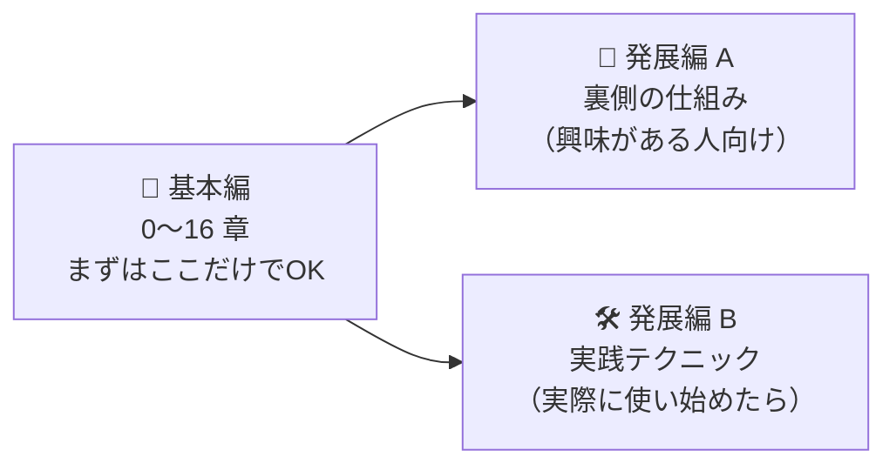

- **基本編** だけ読めば、Docker を使い始めるのに十分です。
- **発展編** は「なんでこう動くの？」「もっとちゃんと使いたい」と思ったときに読んでください。わからなくても基本編の理解には影響しません。

### 0-2. 図について

この資料では **Mermaid（マーメイド）** という書き方で図を描いています。GitHub、GitLab、VS Code（拡張機能「Markdown Preview Mermaid Support」など）、Notion、Obsidian などで開くと図として表示されます。コードのまま表示されている場合は、これらのツールで開いてみてください。

### 0-3. 心構え

- **エラーが出ても壊れません。** Docker で何かを試して失敗しても、あなたのパソコンが壊れることはまずありません。どんどん試してください。
- **全部を一度に覚えなくて大丈夫。** 最後に「コマンド早見表」があるので、忘れたらそこを見ればOKです。
- **手を動かすのが一番の近道です。** 読むだけでなく、ぜひ実際にコマンドを打ってみてください。

---

## 1. Docker とは何か？（たとえ話から）

### 1-1. 一言でいうと

> **Docker は「アプリと、そのアプリを動かすのに必要なもの一式」を箱に詰めて、どのパソコンでも同じように動かせるようにする道具です。**

この「箱」のことを **コンテナ（container）** と呼びます。

### 1-2. 引っ越しのたとえ

あなたが引っ越しをするとします。

**Docker がない世界：**
新しい家に着いてから「あれ、この家のコンセントの形が違う」「冷蔵庫が入らない」「前の家ではお湯が出たのに、ここでは出ない」……と、家ごとに問題が起きます。

**Docker がある世界：**
あなたの部屋を **まるごとコンテナ（輸送用の箱）に詰めて** 運びます。新しい家に着いたら、箱を置くだけ。箱の中は前と全く同じ環境なので、何も困りません。

プログラムの世界でも、まさにこれと同じことが起きています。

### 1-3. 名前の由来

「Docker」は英語で **港湾労働者（荷物を船に積み下ろしする人）** という意味です。ロゴのクジラが背中にコンテナを乗せているのはそのためです 🐳

貨物の世界では、「どんな荷物でも規格が統一された箱（コンテナ）に詰めれば、船でもトラックでも同じように運べる」という発明が物流を大きく変えました。Docker はこの考え方をソフトウェアに持ち込んだものです。

## 2. なぜ Docker が必要なのか？

### 2-1. 「私のパソコンでは動くのに」問題

プログラミングをしていると、こんな会話がよく起きます。

> Aさん「このプログラム、私のパソコンでは動くよ」
> Bさん「私のパソコンだとエラーが出るんだけど……」

原因はだいたい次のような **環境の違い** です。

| 違いの例 | 具体例 |
|---|---|
| OS が違う | A さんは Mac、B さんは Windows |
| ソフトのバージョンが違う | A さんは Python 3.12、B さんは Python 3.9 |
| 必要なライブラリが入っていない | B さんは `numpy` をインストールしていない |
| 設定が違う | 環境変数、文字コード、パスの設定など |

Docker を使えば、**「環境ごと」配る** ことができるので、この問題がほぼなくなります。

### 2-2. Docker のうれしいこと まとめ

1. **誰のパソコンでも同じように動く**（再現性）
2. **自分のパソコンを汚さない**
   いろいろなソフトをインストールしても、コンテナを消せばきれいさっぱり消えます。
3. **すぐに捨てて、すぐに作り直せる**
   失敗したら消して作り直せばいいだけ。
4. **複数のバージョンを同時に使える**
   Python 3.9 と 3.12 を同じパソコンで、ケンカさせずに使えます。
5. **本番環境（実際のサービス）でもそのまま使える**
   開発で使った箱を、そのままサーバーに持っていけます。

### 2-3. 「仮想マシン」との違い（ちょっとだけ詳しい話）

似たような技術に **仮想マシン（VM: Virtual Machine）** があります。VirtualBox や VMware などを聞いたことがあるかもしれません。

| | 仮想マシン | Docker コンテナ |
|---|---|---|
| たとえ | **家をまるごと 1 軒建てる** | **マンションの 1 部屋を借りる** |
| 中身 | OS をまるごと 1 つ動かす | OS の中心部分（カーネル）は共有する |
| 起動時間 | 数十秒〜数分 | 数秒以下 |
| サイズ | 数 GB〜数十 GB | 数 MB〜数百 MB くらいが多い |
| 重さ | 重い | 軽い |

マンションの部屋（コンテナ）は、建物の土台・水道・電気（＝OS のカーネル）を共有しているので、1 軒家（仮想マシン）を建てるよりずっと手軽で速いのです。

図にすると、積み重なっている「層」の数の違いがよくわかります。

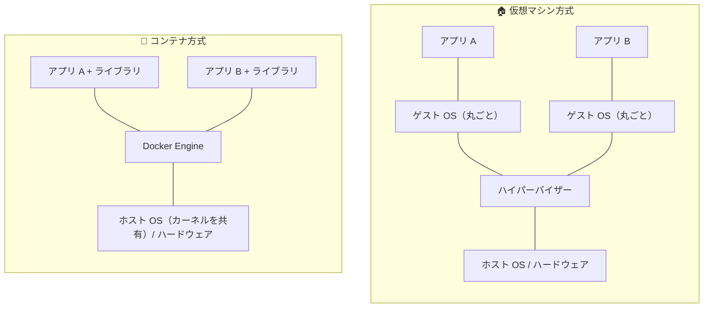

コンテナ方式には「ゲスト OS（丸ごと）」の層がありません。これが軽さの秘密です。

> 💡 **補足**：Mac や Windows で Docker を使う場合、裏側では小さな Linux の仮想マシンがこっそり動いています。Docker Desktop がそれを自動で面倒見てくれるので、普段は気にしなくて大丈夫です。


## 3. 絶対に覚えておきたい 3 つの言葉

Docker で一番大事なのは、次の 3 つの言葉の関係です。**ここだけは必ず理解してください。**

### 3-1. イメージ（Image）

> **コンテナの「設計図」または「型」です。**

- 「Python 3.12 が入った Linux」「nginx（Web サーバー）が入った Linux」などの **ひな形** です。
- イメージ自体は **読み取り専用** で、動きません。

### 3-2. コンテナ（Container）

> **イメージから作られた「実際に動いている箱」です。**

- 1 つのイメージから、**いくつでも** コンテナを作れます。
- コンテナの中でファイルを作ったり変更したりしても、元のイメージは変わりません。

### 3-3. Dockerfile（ドッカーファイル）

> **イメージを作るための「レシピ（作り方の手順書）」です。**

- 「Ubuntu をベースにして、Python を入れて、このファイルをコピーして……」という手順を書いたテキストファイルです。

### 3-4. 3 つの関係をたい焼きで理解する 🐟

| Docker の言葉 | たい焼きでいうと |
|---|---|
| **Dockerfile** | たい焼きの **レシピ**（型の作り方） |
| **イメージ** | たい焼きの **焼き型**（鉄の型） |
| **コンテナ** | 焼き上がった **たい焼き** そのもの |

- 1 つの焼き型（イメージ）から、たい焼き（コンテナ）は何個でも作れます。
- たい焼きをかじっても（コンテナの中身を変えても）、焼き型（イメージ）は変わりません。

流れを図にすると、こうなります。

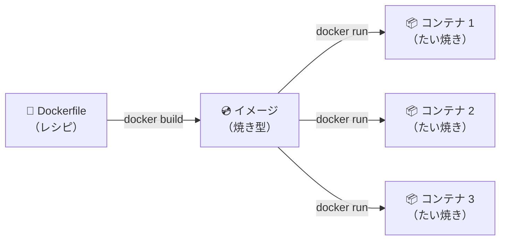

### 3-5. もう 1 つ：Docker Hub（ドッカーハブ）

> **世界中の人が作ったイメージが置いてある「イメージの倉庫（お店）」です。**

- URL: https://hub.docker.com/
- `python`、`nginx`、`mysql`、`ubuntu` など、よく使うイメージは公式（Official Image）が用意されています。
- 自分で一から作らなくても、ここから **ダウンロード（pull）** してすぐ使えます。

## 4. Docker をインストールしよう

インストール方法は、大きく分けて 2 通りあります。自分に合うほうを選んでください。

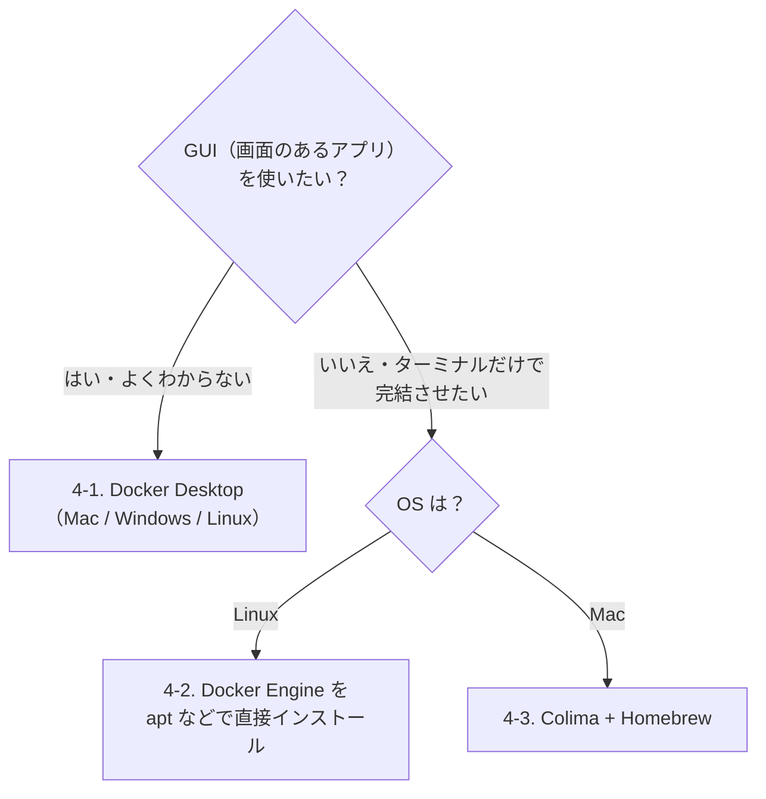

| 方法 | 対象 | 特徴 |
|---|---|---|
| **Docker Desktop** | Mac / Windows / Linux | クリックだけで入る。GUI で状態を確認できる。一定規模以上の企業での利用は有料プラン（個人・教育・小規模企業は無料） |
| **Docker Engine（CLI のみ）** | Linux | Docker 本来の姿。サーバーでも使われる方法。無料 |
| **Colima** | Mac（Linux も可） | GUI なしで Mac に Docker 環境を作れる。Homebrew で入る。無料・オープンソース |

> 💡 どの方法で入れても、**`docker` コマンドの使い方は全く同じ** です。5 章以降の内容はどれを選んでもそのまま使えます。

### 4-1. Docker Desktop を入れる（Mac / Windows）

GUI でよければ、初心者は **Docker Desktop** を入れるのが一番簡単です。

1. 公式サイトにアクセスします：https://www.docker.com/products/docker-desktop/
2. 自分の OS に合ったものをダウンロードします。
   - **Mac の場合**：チップの種類に注意してください。
     - 画面左上の  マーク →「このMacについて」を開く
     - 「チップ」に **Apple M1 / M2 / M3 / M4…** と書いてあれば **Apple Silicon 版**
     - 「プロセッサ」に **Intel** と書いてあれば **Intel 版**
   - **Windows の場合**：インストール中に **WSL 2** を使う設定にチェックを入れてください（通常はデフォルトで入っています）。
3. ダウンロードしたファイルを開いて、画面の指示どおりにインストールします。
   - Mac：`Docker.dmg` を開き、クジラのアイコンを「Applications」フォルダにドラッグ
   - Windows：`Docker Desktop Installer.exe` をダブルクリック
4. **Docker Desktop を起動します。**
   - 初回は利用規約への同意や、アカウント作成をすすめる画面が出ます。アカウントは **作らなくても（Skip しても）使えます**。
5. 画面上部（Mac）またはタスクバー右下（Windows）に **クジラのアイコン 🐳** が出て、動きが止まったら準備完了です。

> ⚠️ **超重要**：Docker のコマンドを使うときは、**Docker Desktop が起動している必要があります。** 「動かない！」と思ったら、まずクジラのアイコンがあるか確認しましょう。

### 4-2. Linux に CLI だけで入れる（Docker Engine）

Linux では、GUI なしの **Docker Engine** を直接インストールするのが一般的です。ここでは **Ubuntu** を例に、公式の手順（apt リポジトリを使う方法）を説明します。

> ⚠️ Ubuntu 公式の `apt install docker.io` でも入りますが、バージョンが古めのことがあり、`docker compose` が入らないこともあります。**Docker 公式のリポジトリから入れる** のがおすすめです。

#### 手順 0：古いものが入っていたら消す（念のため）

```bash
for pkg in docker.io docker-doc docker-compose docker-compose-v2 podman-docker containerd runc; do
  sudo apt remove -y $pkg
done
```

「パッケージが見つからない」と言われても問題ありません（入っていなかっただけです）。

#### 手順 1：Docker 公式のリポジトリ（ダウンロード元）を登録する

```bash
# 必要な道具を入れる
sudo apt update
sudo apt install -y ca-certificates curl

# Docker の「署名鍵」をダウンロードする（ダウンロードしたものが本物か確かめるため）
sudo install -m 0755 -d /etc/apt/keyrings
sudo curl -fsSL https://download.docker.com/linux/ubuntu/gpg -o /etc/apt/keyrings/docker.asc
sudo chmod a+r /etc/apt/keyrings/docker.asc

# 「Docker はここからダウンロードしてね」という設定ファイルを作る
sudo tee /etc/apt/sources.list.d/docker.sources <<EOF
Types: deb
URIs: https://download.docker.com/linux/ubuntu
Suites: $(. /etc/os-release && echo "${UBUNTU_CODENAME:-$VERSION_CODENAME}")
Components: stable
Architectures: $(dpkg --print-architecture)
Signed-By: /etc/apt/keyrings/docker.asc
EOF

# 登録したリポジトリの情報を読み込む
sudo apt update
```

| 部分 | 意味 |
|---|---|
| `sudo` | 管理者の権限で実行する（パスワードを聞かれたら自分のログインパスワードを入力） |
| `$(. /etc/os-release && echo ...)` | 自分の Ubuntu のコードネーム（`noble` など）を自動で埋め込む |
| `$(dpkg --print-architecture)` | 自分の CPU の種類（`amd64` / `arm64`）を自動で埋め込む |

#### 手順 2：Docker をインストールする

```bash
sudo apt install -y docker-ce docker-ce-cli containerd.io docker-buildx-plugin docker-compose-plugin
```

| パッケージ | 中身 |
|---|---|
| `docker-ce` | Docker Engine 本体（dockerd） |
| `docker-ce-cli` | `docker` コマンド |
| `containerd.io` | コンテナを管理する裏方（発展編 A-1 参照） |
| `docker-buildx-plugin` | `docker build` の高機能版（BuildKit） |
| `docker-compose-plugin` | `docker compose` コマンド（11 章で使う） |

#### 手順 3：Docker を起動し、パソコン起動時に自動で立ち上がるようにする

```bash
sudo systemctl enable --now docker
sudo systemctl status docker   # 「active (running)」と出ればOK（q キーで抜ける）
```

> 💡 **systemctl** は、Linux で「裏で動き続けるプログラム（サービス）」を管理するコマンドです。`enable` で自動起動を ON、`--now` で今すぐ起動、の意味です。

#### 手順 4：動作確認

```bash
sudo docker run hello-world
```

`Hello from Docker!` が出れば成功です。

#### 手順 5：`sudo` なしで docker を使えるようにする（任意）

毎回 `sudo` を付けるのは面倒なので、自分を **`docker` グループ** に追加します。

```bash
sudo usermod -aG docker $USER
```

その後、**一度ログアウトしてログインし直します**（SSH なら接続し直す）。すぐ試したい場合は、次のコマンドでもそのターミナルだけ反映されます。

```bash
newgrp docker
```

```bash
docker run hello-world   # sudo なしで動けばOK
```

> ⚠️ **セキュリティの注意**
> `docker` グループに入ったユーザーは、**実質的に root（管理者）と同じ権限** を持ちます（コンテナ経由でホストのファイルを何でも読み書きできてしまうため）。共有サーバーなどでは、誰を `docker` グループに入れるか慎重に決めましょう。
> より安全にしたい場合は、root 権限なしで Docker を動かす **Rootless モード** もあります：https://docs.docker.com/engine/security/rootless/

#### Ubuntu 以外のディストリビューション

Debian、Fedora、RHEL などでも、手順の流れ（リポジトリ登録 → インストール → `systemctl enable --now docker`）は同じです。コマンドの細部は公式ドキュメントを見てください。

- https://docs.docker.com/engine/install/

> 💡 **お試し用の一発インストール**
> 検証用の環境なら、公式のインストールスクリプトでも入れられます（**本番サーバーには非推奨** と公式に書かれています）。
> ```bash
> curl -fsSL https://get.docker.com -o get-docker.sh
> sudo sh get-docker.sh
> ```

### 4-3. Mac に CLI だけで入れる（Colima）

Mac で GUI を使わずに Docker を使うなら、**Colima（コリマ）** が定番です。

#### Colima とは？

発展編 A-8 で説明しますが、Docker は Linux の機能を使うので、**Mac では裏で Linux の仮想マシン（VM）が必要** です。Docker Desktop はこの VM を GUI アプリが管理しますが、Colima は **ターミナルのコマンドだけで VM を管理** します。

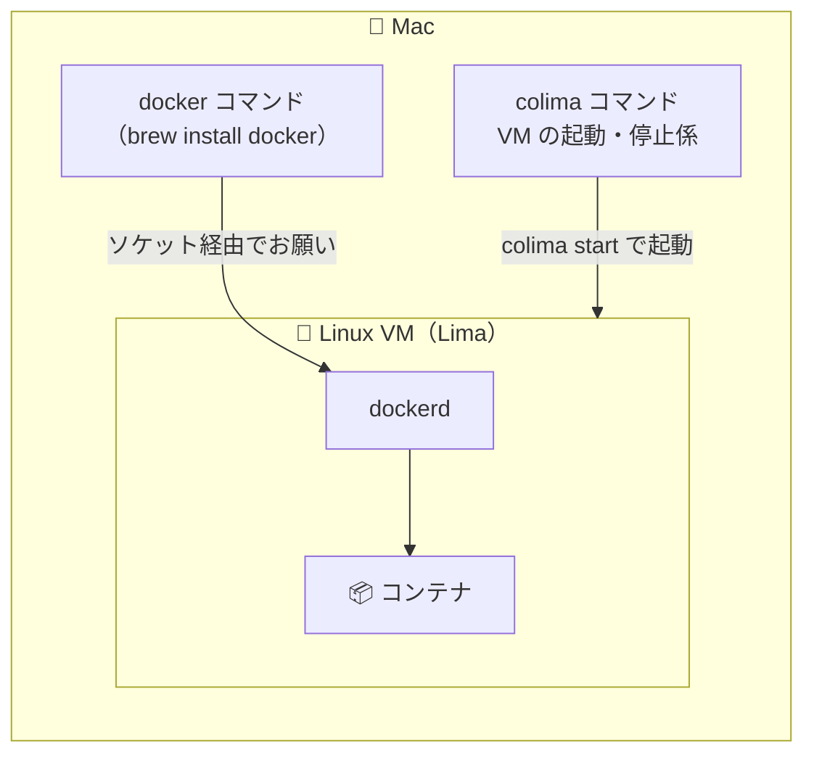

#### 手順 0：Homebrew を用意する

**Homebrew** は Mac 用のソフトをコマンドで入れるための道具です。まだ入っていなければ、https://brew.sh/ に書かれている 1 行のコマンドをターミナルに貼り付けて実行してください。

```bash
brew --version   # バージョンが出れば OK
```

#### 手順 1：必要なものをインストールする

```bash
brew install colima docker docker-compose docker-buildx
```

| パッケージ | 中身 |
|---|---|
| `colima` | Linux VM を作って、その中で Docker Engine を動かす係 |
| `docker` | `docker` コマンド（CLI）だけ。**Docker Desktop ではありません** |
| `docker-compose` | `docker compose` コマンド（11 章で使う） |
| `docker-buildx` | `docker build` の高機能版（BuildKit） |

> ⚠️ `brew install --cask docker` は **Docker Desktop（GUI 版）** を入れるコマンドです。`--cask` を付けないように注意してください。

#### 手順 2：`docker compose` / `docker buildx` を使えるように設定する

Homebrew で入れた `docker-compose` と `docker-buildx` は、そのままだと `docker compose`（スペース区切り）の形で呼び出せません。**Docker にプラグインの置き場所を教えてあげる** 必要があります。

設定ファイル `~/.docker/config.json` に、次の 1 項目を追加します。

```json
{
  "cliPluginsExtraDirs": [
    "/opt/homebrew/lib/docker/cli-plugins"
  ]
}
```

- **ファイルがない場合**：上の内容でそのまま新規作成すればOKです。
  ```bash
  mkdir -p ~/.docker
  cat ~/.docker/config.json 2>/dev/null || echo "（ファイルはまだありません）"
  ```
- **ファイルがすでにある場合**：中身を消さずに、一番外側の `{ }` の中に `"cliPluginsExtraDirs": [...]` を **追記** してください（項目の間は `,` で区切ります）。
- **Intel Mac の場合**：パスは `/usr/local/lib/docker/cli-plugins` になります。（`brew --prefix` で表示される場所 + `/lib/docker/cli-plugins` です）

> 💡 この手順は、`brew install` の最後に表示される案内（Caveats）にも書かれています。`brew info docker-compose` で読み直せます。

#### 手順 3：Colima を起動する

```bash
colima start
```

初回は VM のダウンロードと作成があるので、数分かかります。

デフォルトでは **CPU 2 コア・メモリ 2GB・ディスク 100GB** の VM が作られます。足りなければ指定できます。

```bash
colima start --cpu 4 --memory 8 --disk 100
```

> 💡 **Apple Silicon（M1〜）の Mac の場合**
> 次のオプションを付けると、Apple 純正の仮想化（`vz`）を使い、Intel 向け（amd64）イメージも **Rosetta 2** で高速に動かせるようになります（macOS 13 以降）。
> ```bash
> colima start --vm-type vz --vz-rosetta
> ```

> ⚠️ 一度作った VM の CPU・メモリを変えたいときは、`colima stop` してから新しいオプション付きで `colima start` し直すか、`colima start --edit` で設定ファイルを編集します。（ディスクサイズは、後から小さくはできません）

#### 手順 4：動作確認

```bash
colima status          # colima is running と出ればOK
docker run hello-world # Hello from Docker! が出れば成功
docker compose version # Docker Compose version v2.x.x が出ればOK
```

#### Colima の日常の操作

| やりたいこと | コマンド |
|---|---|
| 起動する | `colima start` |
| 止める（メモリを解放したいとき） | `colima stop` |
| 状態を確認 | `colima status` |
| VM の中に入る | `colima ssh` |
| Mac 起動時に自動で起動する | `brew services start colima` |
| VM を完全に削除する（イメージやボリュームも消える） | `colima delete` |

> ⚠️ **超重要**：Docker Desktop の「クジラのアイコン」の代わりに、Colima では **`colima start` を実行して VM が起動している必要があります。** Mac を再起動した後に `Cannot connect to the Docker daemon` と出たら、まず `colima start` です。

#### Colima を使うときの注意点

- **フォルダの共有（9 章のバインドマウント）**：Colima は、デフォルトで **ホームディレクトリ（`~`）以下** を VM と共有します。作業フォルダはホームディレクトリの中に置きましょう。それ以外の場所を使いたい場合は `colima start --edit` で `mounts` を設定します。
- **他のツールが Docker を見つけられないとき**：`docker` コマンド自体は Colima を自動で使いますが（`docker context ls` で `colima` に `*` が付いています）、一部のツールは決め打ちの場所を探しに行きます。その場合は環境変数を設定します。
  ```bash
  export DOCKER_HOST="unix://$HOME/.colima/default/docker.sock"
  ```
- **Docker Desktop と共存させる場合**：`docker context use colima` / `docker context use desktop-linux` で、どちらにお願いを送るか切り替えられます。

### 4-4. インストールできたか確認する

ターミナルを開いて、次のコマンドを打ってください。

```bash
docker --version
```

次のように **バージョン番号** が表示されれば成功です。

```text
Docker version 27.x.x, build xxxxxxx
```

続けて、Docker Compose（後で使います）も確認しておきましょう。

```bash
docker compose version
```

```text
Docker Compose version v2.x.x
```

> 💡 `command not found: docker` と出たら、インストールが完了していません。**ターミナルを一度閉じて開き直して** もう一度試してください。
>
> 💡 `docker compose` だけ `unknown command` になる場合：Linux なら `docker-compose-plugin` が入っているか、Colima なら 4-3 の手順 2（`cliPluginsExtraDirs`）を確認してください。


## 5. はじめてのコンテナを動かそう

### 5-1. hello-world を動かす

伝統的な最初の一歩です。次のコマンドを打ってみましょう。

```bash
docker run hello-world
```

次のようなメッセージが出れば **大成功** です 🎉

```text
Unable to find image 'hello-world:latest' locally
latest: Pulling from library/hello-world
...
Status: Downloaded newer image for hello-world:latest

Hello from Docker!
This message shows that your installation appears to be working correctly.
...
```

### 5-2. いま何が起きたのか？（一行ずつ解説）

たった 1 行のコマンドで、裏ではこんなことが起きていました。

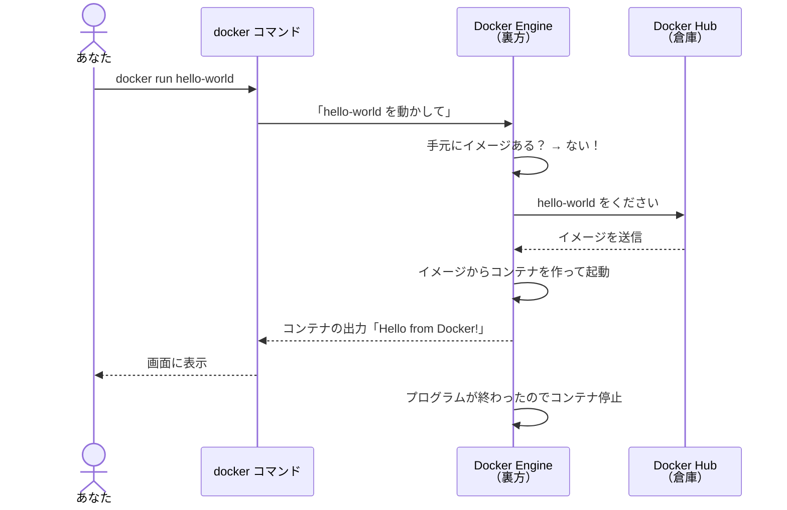

1. **`Unable to find image 'hello-world:latest' locally`**
   →「あなたのパソコンの中に `hello-world` というイメージ（焼き型）が見つからないよ」
2. **`Pulling from library/hello-world`**
   →「じゃあ Docker Hub（倉庫）からダウンロードしてくるね」
3. **`Downloaded newer image`**
   →「ダウンロード完了！」
4. **`Hello from Docker!`**
   → イメージからコンテナ（たい焼き）を作って実行した結果、このメッセージが表示された
5. メッセージを表示し終えたので、**コンテナは自動的に停止** しました。

### 5-3. コマンドの形を理解する

Docker のコマンドは、だいたいこの形をしています。

```text
docker  <何をするか>  [オプション]  <対象>
```

| 部分 | 今回の例 | 意味 |
|---|---|---|
| `docker` | `docker` | 「Docker さん、お願いします」 |
| `<何をするか>` | `run` | 「動かして」 |
| `<対象>` | `hello-world` | 「hello-world というイメージを」 |

### 5-4. もう一度実行してみよう

```bash
docker run hello-world
```

今度は `Unable to find image...` や `Pulling...` が出ずに、すぐ `Hello from Docker!` が表示されたはずです。

**一度ダウンロードしたイメージはパソコンに保存されている** ので、2 回目以降はダウンロード不要なのです。

### 5-5. 持っているイメージを確認する

```bash
docker images
```

```text
REPOSITORY    TAG       IMAGE ID       CREATED        SIZE
hello-world   latest    xxxxxxxxxxxx   x months ago   xx kB
```

| 列 | 意味 |
|---|---|
| REPOSITORY | イメージの名前 |
| TAG | バージョンのようなもの（`latest` は「最新版」の意味） |
| IMAGE ID | イメージの固有番号 |
| CREATED | イメージが作られた日 |
| SIZE | 大きさ |

> 💡 **タグ（TAG）について**
> イメージ名の後ろに `:` をつけてバージョンを指定できます。
> 例：`python:3.12`、`python:3.11`、`nginx:1.27`
> 何も書かないと自動的に `:latest` が付きます。
> 実際の開発では、**`latest` ではなく具体的なバージョンを指定する** のがおすすめです（いつの間にか中身が変わって動かなくなる事故を防げます）。


## 6. コンテナの一生を体験しよう

コンテナには「生まれる → 動く → 止まる → 消える」という一生があります。

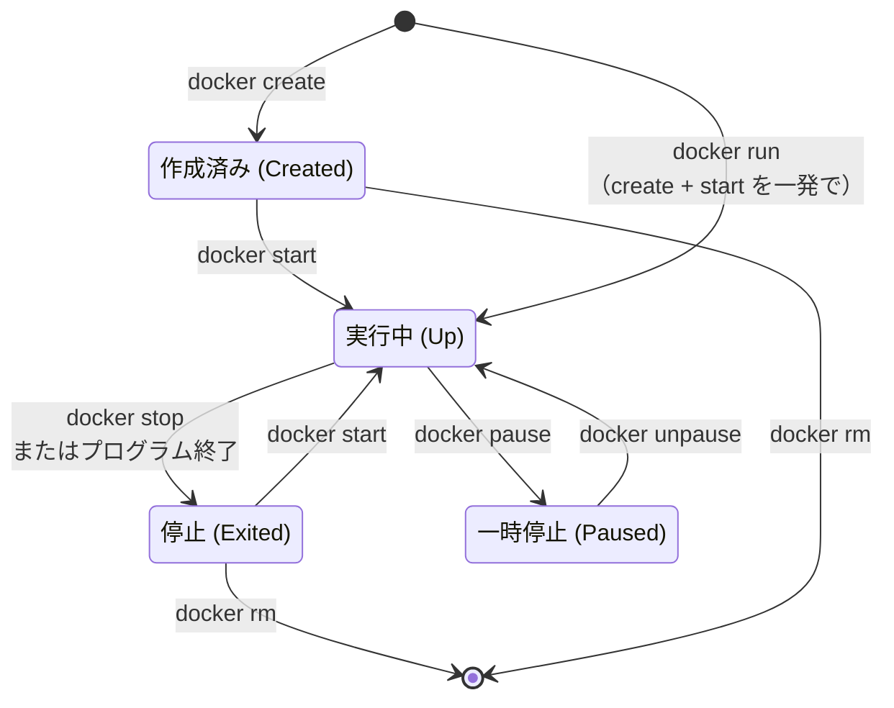

> 💡 `pause` はあまり使いません。まずは **run → stop → start → rm** の 4 つを覚えれば十分です。

### 6-1. 動いているコンテナを見る：`docker ps`

```bash
docker ps
```

```text
CONTAINER ID   IMAGE     COMMAND   CREATED   STATUS    PORTS     NAMES
```

何も表示されません。さっきの hello-world はメッセージを出して **すぐ終了した** からです。

### 6-2. 止まっているコンテナも見る：`docker ps -a`

```bash
docker ps -a
```

```text
CONTAINER ID   IMAGE         COMMAND    CREATED         STATUS                     PORTS   NAMES
a1b2c3d4e5f6   hello-world   "/hello"   2 minutes ago   Exited (0) 2 minutes ago           happy_turing
f6e5d4c3b2a1   hello-world   "/hello"   5 minutes ago   Exited (0) 5 minutes ago           sleepy_euler
```

- `-a` は **all（すべて）** の意味です。
- `STATUS` が `Exited (0)` → 「正常に終了した」という意味です（`0` は「エラーなし」）。
- `NAMES` は Docker が自動でつけた **ランダムな名前** です（`happy_turing` など、ちょっと面白い名前がつきます）。
- 2 回 `docker run` したので、**コンテナが 2 つ** できています。`run` するたびに新しいたい焼きが焼かれる、というわけです。

### 6-3. 長く動き続けるコンテナを作る

hello-world はすぐ終わってしまうので、ずっと動き続けるコンテナを作ってみましょう。Web サーバーソフトの **nginx（エンジンエックス）** を使います。

```bash
docker run -d --name my-nginx nginx
```

| オプション | 意味 |
|---|---|
| `-d` | **detach（切り離す）**。コンテナを裏側（バックグラウンド）で動かす。これを付けないとターミナルが占領されてしまう |
| `--name my-nginx` | コンテナに `my-nginx` という **名前を付ける**。付けないとランダムな名前になって不便 |
| `nginx` | 使うイメージの名前 |

実行すると、長い英数字（コンテナ ID）が表示されます。

```bash
docker ps
```

```text
CONTAINER ID   IMAGE   COMMAND                  CREATED          STATUS          PORTS    NAMES
1234567890ab   nginx   "/docker-entrypoint.…"   10 seconds ago   Up 9 seconds    80/tcp   my-nginx
```

`STATUS` が **`Up`（動いている）** になっていますね。

### 6-4. コンテナのログ（出力）を見る：`docker logs`

```bash
docker logs my-nginx
```

コンテナの中で出力されたメッセージが表示されます。リアルタイムで見続けたいときは `-f`（follow）を付けます。

```bash
docker logs -f my-nginx
```

> 💡 `-f` で見ているときに元に戻るには、**`Ctrl + C`** を押します。（ログを見るのをやめるだけで、コンテナは止まりません）

### 6-5. コンテナを止める：`docker stop`

```bash
docker stop my-nginx
```

```bash
docker ps      # 何も出ない（止まったので）
docker ps -a   # STATUS が Exited になっている
```

### 6-6. 止めたコンテナを再開する：`docker start`

```bash
docker start my-nginx
docker ps      # また Up になっている
```

### 6-7. コンテナを削除する：`docker rm`

```bash
docker stop my-nginx
docker rm my-nginx
```

> ⚠️ **動いているコンテナはそのままでは削除できません。** 先に `docker stop` で止めてください。
> （どうしても一発で消したいときは `docker rm -f my-nginx` で強制削除できます）

> ⚠️ **コンテナを削除すると、コンテナの中で作ったファイルも全部消えます。** データを残したい場合は、後で説明する「ボリューム」を使います。

### 6-8. 使い捨てコンテナ：`--rm`

「終わったら自動で消えてほしい」ときは `--rm` を付けます。

```bash
docker run --rm hello-world
```

```bash
docker ps -a   # 今の hello-world は残っていない
```

ちょっと試したいときに便利です。


## 7. コンテナの中に入ってみよう

コンテナは「小さな Linux パソコン」のようなものです。中に入って操作することもできます。

### 7-1. Ubuntu のコンテナに入る

```bash
docker run -it --rm ubuntu bash
```

| オプション | 意味 |
|---|---|
| `-i` | **interactive（対話的）**。キーボード入力を受け付ける |
| `-t` | **tty**。ターミナルらしい画面表示にする |
| `-it` | 上の 2 つを合体させた書き方。**「中に入って操作したいときは `-it`」** と覚えればOK |
| `--rm` | 抜けたら自動で削除 |
| `ubuntu` | Ubuntu（Linux の一種）のイメージ |
| `bash` | コンテナの中で `bash`（コマンドを受け付けるプログラム）を起動する |

すると、ターミナルの表示がこのように変わります。

```text
root@a1b2c3d4e5f6:/#
```

**これで、あなたはコンテナの中にいます！** 🎉

### 7-2. 中でいろいろ試してみる

```bash
cat /etc/os-release   # OS の情報を表示
```

```text
PRETTY_NAME="Ubuntu 24.04.x LTS"
...
```

Mac や Windows を使っているのに、Ubuntu と表示されました。ここは確かに **別の環境** なのです。

```bash
ls /           # ファイル一覧
whoami         # 自分は誰？ → root（管理者）
echo "こんにちは" > hello.txt
cat hello.txt
```

### 7-3. コンテナから出る

```bash
exit
```

元のターミナルに戻りました。`--rm` を付けたので、コンテナは自動で消えています。さっき作った `hello.txt` ももうありません。

> 💡 **ここでの大事な気づき**
> コンテナの中で何をしても（たとえ `rm -rf` で全部消しても）、**あなたのパソコンには影響しません。** 安心して実験できる「砂場」なのです。

### 7-4. 動いているコンテナに後から入る：`docker exec`

すでに動いているコンテナの中に入りたいときは、`docker exec` を使います。

```bash
docker run -d --name my-nginx nginx     # nginx を裏で起動
docker exec -it my-nginx bash           # その中に入る
```

```bash
ls /usr/share/nginx/html   # nginx が表示するファイルが置いてある場所
exit                       # 出る（exec で入った場合、出てもコンテナは止まらない）
```

```bash
docker rm -f my-nginx      # 後片付け
```

| コマンド | 使いどころ |
|---|---|
| `docker run -it ...` | **新しく** コンテナを作って中に入る |
| `docker exec -it ...` | **すでに動いている** コンテナの中に入る |


## 8. Web サーバーを動かしてみよう（ポートの話）

### 8-1. ポートとは？

**ポート** とは、パソコンの「窓口の番号」のようなものです。

> パソコンを「大きな建物」とすると、ポートは「部屋番号」です。
> Web サーバーは「80 番の部屋」、データベースは「3306 番の部屋」……というふうに、プログラムごとに受付の部屋番号が決まっています。

### 8-2. コンテナは「閉じた箱」

コンテナは外の世界と隔離されています。nginx がコンテナの中で 80 番ポートで待っていても、**そのままではあなたのパソコン（ブラウザ）から見えません。**

そこで、**「パソコンの○番ポート」と「コンテナの△番ポート」をつなぐ** 必要があります。これを **ポートフォワーディング（ポートの転送）** と呼びます。

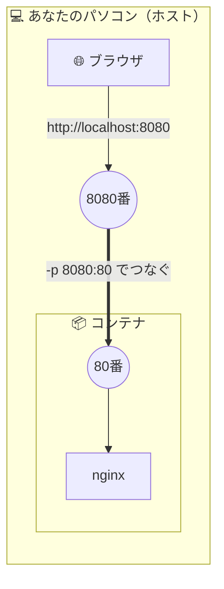

### 8-3. 実際にやってみよう

```bash
docker run -d --name my-web -p 8080:80 nginx
```

| オプション | 意味 |
|---|---|
| `-p 8080:80` | **「パソコンの 8080 番」を「コンテナの 80 番」につなぐ** |

> 🧠 **覚え方**：`-p 外:中`（**左が自分のパソコン、右がコンテナ**）

ブラウザを開いて、次の URL にアクセスしてください。

**http://localhost:8080**

**「Welcome to nginx!」** と表示されたら成功です 🎉

> 💡 `localhost` とは「自分自身のパソコン」を意味する特別な名前です。

### 8-4. ポート番号を変えてみる

```bash
docker run -d --name my-web2 -p 9090:80 nginx
```

http://localhost:9090 でも同じページが見えます。**同じイメージから 2 つのコンテナ** が動いている状態です（たい焼き 2 個！）。

### 8-5. 後片付け

```bash
docker rm -f my-web my-web2
```


## 9. ファイルを共有しよう（ボリュームの話）

### 9-1. コンテナの弱点

6 章で説明したとおり、**コンテナを削除すると、中のデータも消えます。**

- データベースのデータが消えたら困りますよね？
- パソコンで書いたプログラムを、コンテナの中で動かしたいこともありますよね？

そこで使うのが **ボリューム（volume）** や **バインドマウント（bind mount）** です。

### 9-2. 2 つの方法

| 方法 | ざっくり説明 | 主な使いどころ |
|---|---|---|
| **バインドマウント** | **パソコンのフォルダ** をコンテナの中に「窓」でつなぐ | 開発中のソースコードを共有したいとき |
| **ボリューム** | **Docker が管理する専用の保管場所** を使う | データベースのデータなど、残しておきたいデータ |

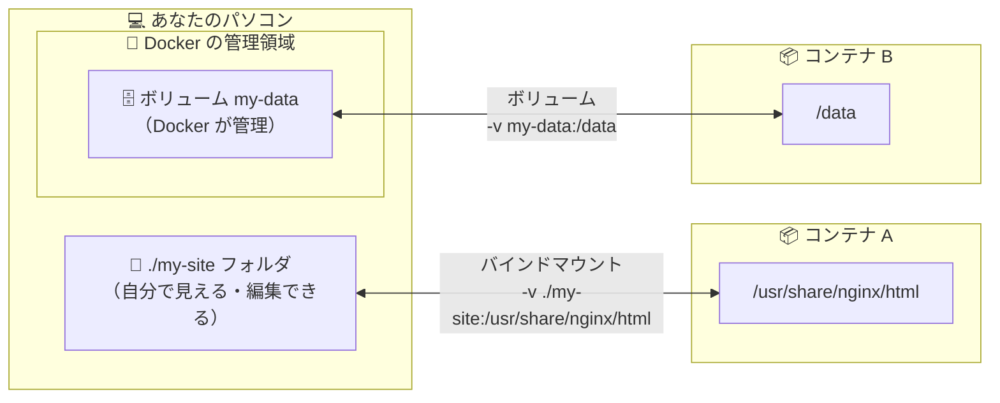

どちらも「コンテナの外にデータを置く」点は同じなので、**コンテナを消してもデータは残ります。**

### 9-3. バインドマウントを体験する

まず、作業用のフォルダを作ります。

```bash
mkdir my-site
cd my-site
```

`index.html` というファイルを作ります。お好きなテキストエディタ（VS Code など）で作ってもいいですし、次のコマンドでも作れます。

```bash
echo '<h1>Hello, Docker! これは私のページです</h1>' > index.html
```

> 💡 文字化けする場合は、`<meta charset="UTF-8">` を先頭に入れてください：
> ```bash
> echo '<meta charset="UTF-8"><h1>Hello, Docker! これは私のページです</h1>' > index.html
> ```

このフォルダを nginx コンテナにつなぎます。

**Mac / Linux の場合：**

```bash
docker run -d --name my-site -p 8080:80 -v "$(pwd)":/usr/share/nginx/html nginx
```

**Windows（PowerShell）の場合：**

```powershell
docker run -d --name my-site -p 8080:80 -v "${PWD}:/usr/share/nginx/html" nginx
```

| 部分 | 意味 |
|---|---|
| `-v 外:中` | **パソコンのフォルダ（外）** を **コンテナのフォルダ（中）** につなぐ |
| `$(pwd)` / `${PWD}` | 「今いるフォルダ」を表す書き方 |
| `/usr/share/nginx/html` | nginx が Web ページを探しにいくフォルダ |

> 🧠 `-p` と同じく、`-v` も **「左が外（パソコン）、右が中（コンテナ）」** です。

http://localhost:8080 を開くと、あなたが作ったページが表示されます！

### 9-4. リアルタイムで反映されることを確認

コンテナを動かしたまま、`index.html` を書き換えてみましょう。

```bash
echo '<meta charset="UTF-8"><h1>書き換えました！</h1>' > index.html
```

ブラウザを **再読み込み（F5 / Cmd + R）** すると、**すぐに内容が変わります**。パソコンのフォルダとコンテナのフォルダが、本当につながっているのです。

```bash
docker rm -f my-site   # 後片付け（index.html はパソコンに残ります）
```

### 9-5. ボリュームを体験する

```bash
# ボリュームを作る
docker volume create my-data

# ボリュームをつないだコンテナでファイルを作る
docker run --rm -v my-data:/data ubuntu bash -c "echo '大事なデータ' > /data/memo.txt"

# 別のコンテナから同じボリュームを読む
docker run --rm -v my-data:/data ubuntu cat /data/memo.txt
```

```text
大事なデータ
```

1 つ目のコンテナは `--rm` で消えているのに、**データはボリュームに残っています。** これがボリュームの力です。

```bash
docker volume ls          # ボリューム一覧
docker volume rm my-data  # ボリュームを削除（データも消えます！）
```

> 💡 `-v` の左側が **`/` や `.` で始まるパス** ならバインドマウント、**ただの名前** ならボリューム、と Docker は判断します。


## 10. 自分だけのイメージを作ろう（Dockerfile）

ここまでは他の人が作ったイメージを使ってきました。今度は **自分でイメージ（焼き型）を作って** みましょう。

### 10-1. 作るもの

「`Hello from my container!` と表示する Python プログラム」を、Docker イメージにします。

> 💡 あなたのパソコンに Python がインストールされていなくても大丈夫です。Python はコンテナの中に入れるからです。これこそが Docker のうれしいところ！

### 10-2. 準備

新しいフォルダを作って移動します。

```bash
cd ..             # さっきの my-site フォルダから出る
mkdir my-python-app
cd my-python-app
```

### 10-3. Python のプログラムを書く

`app.py` というファイルを作り、次の内容を書きます。

```python
import platform

print("Hello from my container!")
print(f"Python のバージョン: {platform.python_version()}")
print(f"OS: {platform.system()}")
```

### 10-4. Dockerfile を書く

同じフォルダに、**`Dockerfile`** という名前のファイルを作ります。

> ⚠️ **ファイル名に注意！**
> - 名前は **`Dockerfile`**（D は大文字、拡張子なし）
> - `Dockerfile.txt` になっていないか確認してください（Windows のメモ帳は勝手に `.txt` を付けることがあります）

中身は次のとおりです。

```dockerfile
# ① ベースにするイメージ（土台）を選ぶ
FROM python:3.12-slim

# ② コンテナの中の作業フォルダを決める
WORKDIR /app

# ③ パソコンのファイルをコンテナの中にコピーする
COPY app.py .

# ④ コンテナが起動したときに実行するコマンド
CMD ["python", "app.py"]
```

### 10-5. Dockerfile を一行ずつ解説

| 命令 | 意味 | たとえ |
|---|---|---|
| `FROM python:3.12-slim` | Python 3.12 が入った軽量な Linux を **土台** にする | 「市販のスポンジケーキを買ってくる」 |
| `WORKDIR /app` | コンテナの中の `/app` フォルダで作業する（なければ作る） | 「作業台をここに決める」 |
| `COPY app.py .` | パソコンの `app.py` を、コンテナの今いるフォルダ（`.` = `/app`）にコピー | 「自分で作ったクリームを乗せる」 |
| `CMD ["python", "app.py"]` | コンテナ起動時に `python app.py` を実行する | 「完成したら、こう食べてね」 |

> 💡 `#` で始まる行は **コメント**（メモ書き）で、Docker は無視します。

### 10-6. イメージをビルド（作成）する

```bash
docker build -t my-python-app .
```

| 部分 | 意味 |
|---|---|
| `docker build` | イメージを作る |
| `-t my-python-app` | **tag（名前）** を `my-python-app` にする |
| `.` | **「今いるフォルダの Dockerfile を使ってね」** という意味。**最後のドットを忘れがち！** |

```text
[+] Building 12.3s (8/8) FINISHED
 => [internal] load build definition from Dockerfile
 => [1/3] FROM docker.io/library/python:3.12-slim
 => [2/3] WORKDIR /app
 => [3/3] COPY app.py .
 => exporting to image
 => => naming to docker.io/library/my-python-app
```

できたか確認します。

```bash
docker images
```

```text
REPOSITORY      TAG       IMAGE ID       CREATED          SIZE
my-python-app   latest    xxxxxxxxxxxx   10 seconds ago   xxxMB
...
```

### 10-7. 自分のイメージからコンテナを作る

```bash
docker run --rm my-python-app
```

```text
Hello from my container!
Python のバージョン: 3.12.x
OS: Linux
```

**🎉 おめでとうございます！ あなたは自分だけの Docker イメージを作りました！**

このイメージは、Docker が入っている **世界中のどのパソコンでも同じように動きます。**

### 10-8. もう少し実用的な例：ライブラリを使う

実際のプログラムでは、外部のライブラリ（他の人が作った便利な部品）を使うことが多いです。その場合の例を見てみましょう。

`requirements.txt`（使うライブラリの一覧）：

```text
requests==2.32.3
```

`app.py` を書き換え：

```python
import requests

response = requests.get("https://api.github.com")
print(f"GitHub API のステータスコード: {response.status_code}")
```

`Dockerfile`：

```dockerfile
FROM python:3.12-slim

WORKDIR /app

# 先にライブラリ一覧だけコピーしてインストールする（理由は下で説明）
COPY requirements.txt .
RUN pip install --no-cache-dir -r requirements.txt

# その後でプログラム本体をコピーする
COPY app.py .

CMD ["python", "app.py"]
```

新しく出てきた命令：

| 命令 | 意味 |
|---|---|
| `RUN ...` | **イメージを作るとき（ビルド時）に** コマンドを実行する。ソフトのインストールなどに使う |

> 🧠 **`RUN` と `CMD` の違い（よく混乱するポイント！）**
> - `RUN`：**イメージを作るとき** に 1 回だけ実行される（例：ライブラリのインストール）
> - `CMD`：**コンテナを起動するたびに** 実行される（例：アプリの起動）
>
> たい焼きでいうと、`RUN` は「焼き型を作るときの作業」、`CMD` は「たい焼きを焼くたびにやる作業」です。

```bash
docker build -t my-python-app .
docker run --rm my-python-app
```

```text
GitHub API のステータスコード: 200
```

### 10-9. なぜ requirements.txt を先にコピーするの？（キャッシュの話）

Docker は Dockerfile の **1 行ごとに結果を保存（キャッシュ）** しています。そして、**ある行に変更があると、その行以降はすべてやり直し** になります。

- `app.py` はよく書き換える
- `requirements.txt` はたまにしか変わらない

なので、**変わりにくいものを上に、変わりやすいものを下に** 書いておくと、`app.py` を直してビルドし直したときに、時間のかかる `pip install` を飛ばせる（キャッシュが使われる）のです。

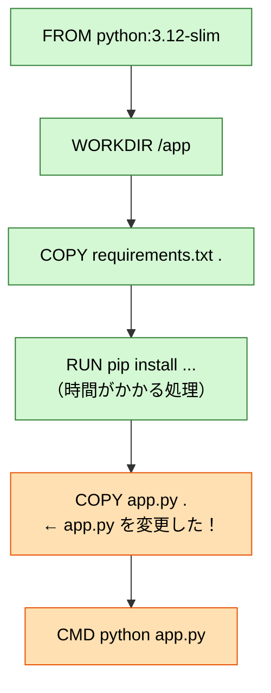

- 🟩 緑：キャッシュが使われる（一瞬で終わる）
- 🟧 オレンジ：やり直しになる

もし順番を逆にして `COPY . .` → `RUN pip install` と書くと、`app.py` を 1 文字変えただけで毎回 `pip install` がやり直しになり、ビルドがとても遅くなります。

### 10-10. よく使う Dockerfile の命令一覧

| 命令 | 意味 | 例 |
|---|---|---|
| `FROM` | 土台となるイメージ | `FROM node:22-slim` |
| `WORKDIR` | 作業フォルダ | `WORKDIR /app` |
| `COPY` | ファイルをコピー | `COPY . .`（全部コピー） |
| `RUN` | ビルド時にコマンド実行 | `RUN apt-get update && apt-get install -y curl` |
| `ENV` | 環境変数を設定 | `ENV TZ=Asia/Tokyo` |
| `EXPOSE` | 使うポートを「メモ」として書く（実際につなぐのは `-p`） | `EXPOSE 8000` |
| `CMD` | 起動時のコマンド | `CMD ["python", "app.py"]` |

### 10-11. `.dockerignore` ファイル

`COPY . .` で「フォルダの中身を全部コピー」するとき、コピーしてほしくないもの（巨大なフォルダ、パスワードが書かれたファイルなど）を除外できます。`.gitignore` と同じような書き方です。

`.dockerignore`：

```text
.git
__pycache__
node_modules
.env
*.log
```


## 11. 複数のコンテナをまとめて動かそう（Docker Compose）

### 11-1. なぜ必要？

実際のアプリは、1 つのコンテナだけで完結しないことが多いです。

- Web アプリ用のコンテナ
- データベース用のコンテナ
- キャッシュ（Redis など）用のコンテナ

これらを毎回 `docker run -d -p ... -v ... --name ...` と長いコマンドで 1 つずつ起動するのは大変ですし、間違えやすいですよね。

**Docker Compose** を使うと、**設定を 1 つのファイル（`compose.yaml`）に書いておいて、コマンド 1 発でまとめて起動・停止** できます。

> 🍱 たとえるなら、単品で 1 品ずつ注文する（`docker run`）のではなく、**お弁当のセット** を 1 回で注文する（`docker compose up`）感じです。

### 11-2. YAML（ヤムル）の超基本

`compose.yaml` は **YAML** という形式で書きます。ルールは少しだけです。

- `キー: 値` の形で書く（**コロンの後ろに半角スペース** が必要）
- **インデント（字下げ）で親子関係を表す**（**半角スペース 2 つ** が一般的。**タブは使えません！**）
- `- ` で始まる行はリスト（箇条書き）

```yaml
# 例
person:
  name: Taro
  hobbies:
    - reading
    - docker
```

### 11-3. 作ってみよう：Web サーバー + データベース

新しいフォルダを作ります。

```bash
cd ..
mkdir my-compose-app
cd my-compose-app
```

`compose.yaml` を作ります。

```yaml
services:
  # 1つ目のサービス：Web サーバー
  web:
    image: nginx:1.27
    ports:
      - "8080:80"
    volumes:
      - ./html:/usr/share/nginx/html

  # 2つ目のサービス：データベース（PostgreSQL）
  db:
    image: postgres:17
    environment:
      POSTGRES_USER: myuser
      POSTGRES_PASSWORD: mypassword
      POSTGRES_DB: mydb
    volumes:
      - db-data:/var/lib/postgresql/data

# ボリュームの宣言
volumes:
  db-data:
```

Web ページ用のファイルも作っておきます。

```bash
mkdir html
echo '<meta charset="UTF-8"><h1>Compose で動いています！</h1>' > html/index.html
```

### 11-4. compose.yaml を解説

| 書き方 | `docker run` でいうと | 意味 |
|---|---|---|
| `services:` | — | 動かすコンテナたちの一覧 |
| `web:` / `db:` | `--name` に近い | サービスの名前（自由に決めてOK） |
| `image: nginx:1.27` | `docker run nginx:1.27` | 使うイメージ |
| `ports: - "8080:80"` | `-p 8080:80` | ポートをつなぐ |
| `volumes: - ./html:/usr/...` | `-v $(pwd)/html:/usr/...` | フォルダをつなぐ |
| `environment:` | `-e POSTGRES_USER=myuser` | **環境変数**（コンテナに渡す設定値） |

> 💡 **環境変数** とは、プログラムに外から渡す「設定値」のことです。PostgreSQL のイメージは、`POSTGRES_PASSWORD` などの環境変数を見て、初期設定を自動で行ってくれます。

> 💡 自分で作った Dockerfile を使いたいときは、`image:` の代わりに `build: .` と書きます。

### 11-5. 起動する

```bash
docker compose up -d
```

```text
[+] Running 4/4
 ✔ Network my-compose-app_default    Created
 ✔ Volume "my-compose-app_db-data"   Created
 ✔ Container my-compose-app-db-1     Started
 ✔ Container my-compose-app-web-1    Started
```

**たった 1 行で、ネットワーク・ボリューム・2 つのコンテナがまとめて作られました！**

作られたものを図にすると、こうなります。

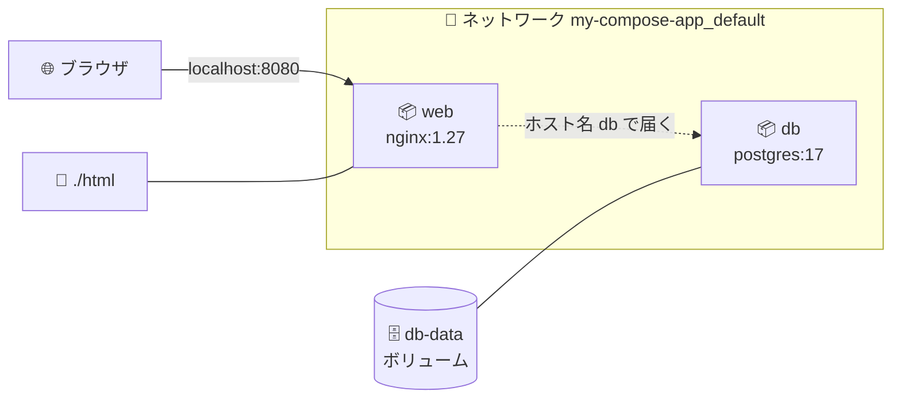

http://localhost:8080 を開くと「Compose で動いています！」と表示されます。

### 11-6. よく使う Compose コマンド

```bash
docker compose ps            # 動いているサービスの一覧
docker compose logs          # 全サービスのログ
docker compose logs -f web   # web サービスのログをリアルタイムで
docker compose exec db psql -U myuser -d mydb   # db コンテナに入って SQL を打つ（\q で抜ける）
docker compose stop          # 停止（コンテナは残る）
docker compose start         # 再開
docker compose down          # 停止して、コンテナとネットワークを削除
docker compose down -v       # ↑に加えて、ボリューム（DBのデータ）も削除 ⚠️
```

> ⚠️ `docker compose down -v` は **データベースのデータも消えます。** 本当に消してよいときだけ使いましょう。

### 11-7. コンテナ同士の通信（ちょっと発展）

Compose で起動したコンテナたちは、**自動的に同じネットワークにつながります。** そして、**サービス名がそのままホスト名（住所）として使えます。**

たとえば、`web` コンテナから `db` コンテナに接続したい場合、接続先は `localhost` ではなく **`db`** と書きます。

```text
postgresql://myuser:mypassword@db:5432/mydb
                                ^^
                                サービス名で届く！
```

> ⚠️ **初心者が一番ハマるポイント**：コンテナの中の `localhost` は **「そのコンテナ自身」** を指します。別のコンテナを `localhost` で呼んでも届きません。

### 11-8. 後片付け

```bash
docker compose down -v
```

## 12. お片付けの方法

Docker を使っていると、イメージやコンテナがどんどんたまって、ディスク容量を圧迫します。定期的にお掃除しましょう。

### 12-1. 何がどれくらい容量を使っているか確認

```bash
docker system df
```

```text
TYPE            TOTAL     ACTIVE    SIZE      RECLAIMABLE
Images          5         1         1.2GB     900MB (75%)
Containers      3         1         10MB      5MB (50%)
Local Volumes   2         1         100MB     50MB (50%)
Build Cache     20        0         300MB     300MB
```

`RECLAIMABLE` は「削除して取り戻せる容量」です。

### 12-2. 個別に削除する

```bash
docker rm <コンテナ名 or ID>       # コンテナを削除
docker rmi <イメージ名 or ID>      # イメージを削除（rmi = remove image）
docker volume rm <ボリューム名>    # ボリュームを削除
```

> 💡 ID は全部打たなくても、**先頭の数文字** だけで OK です（他と区別できれば）。
> 例：`docker rm a1b2`

> ⚠️ そのイメージから作られたコンテナが残っていると、イメージは削除できません。先にコンテナを消しましょう。

### 12-3. まとめて削除する

```bash
docker container prune   # 止まっているコンテナを全部削除
docker image prune       # 使われていない（名前のない）イメージを削除
docker image prune -a    # どのコンテナにも使われていないイメージを全部削除
docker volume prune      # 使われていないボリュームを削除
```

### 12-4. 大掃除

```bash
docker system prune
```

止まっているコンテナ、使われていないネットワーク、名前のないイメージ、ビルドキャッシュをまとめて削除します。実行前に確認（`[y/N]`）が出るので、`y` を押すと実行されます。

> ⚠️ `docker system prune -a --volumes` は **かなり強力** です（使っていないイメージやボリュームのデータまで全部消えます）。何が消えるかわかっているときだけ使いましょう。


## 13. よくあるエラーと対処法

### 13-1. `Cannot connect to the Docker daemon`

```text
Cannot connect to the Docker daemon at unix:///var/run/docker.sock. Is the docker daemon running?
```

**原因**：Docker 本体（デーモン）が動いていません。
**対処**：インストール方法ごとに、Docker 本体を起動します。

| 入れ方 | 起動コマンド・方法 |
|---|---|
| Docker Desktop | アプリを起動し、クジラのアイコンが落ち着くまで待つ |
| Linux（Docker Engine） | `sudo systemctl start docker`（自動起動は `sudo systemctl enable docker`） |
| Mac（Colima） | `colima start`（自動起動は `brew services start colima`） |

起動したら、もう一度コマンドを実行しましょう。

> 💡 **デーモン（daemon）** とは、裏側でずっと動いて仕事を待っているプログラムのことです。`docker` コマンドは、このデーモンに「お願い」を送っているだけなのです。

### 13-2. `port is already allocated`

```text
Bind for 0.0.0.0:8080 failed: port is already allocated
```

**原因**：パソコンの 8080 番ポートを、すでに別のコンテナやアプリが使っています。
**対処**：
- 別のポート番号を使う：`-p 8081:80`
- 使っているコンテナを探して止める：`docker ps` で確認 → `docker stop <名前>`

### 13-3. `The container name "/xxx" is already in use`

```text
Conflict. The container name "/my-nginx" is already in use by container "...".
```

**原因**：同じ名前のコンテナが（止まった状態で）残っています。
**対処**：`docker rm my-nginx` で古いほうを消すか、別の名前を付けましょう。`docker ps -a` で確認できます。

### 13-4. `Unable to find image ... pull access denied`

```text
Unable to find image 'ngnix:latest' locally
docker: Error response from daemon: pull access denied for ngnix, repository does not exist ...
```

**原因**：イメージ名の **タイプミス** がほとんどです（上の例では `nginx` を `ngnix` と打っています）。
**対処**：スペルを確認しましょう。Docker Hub で正しい名前を検索するのも手です。

### 13-5. `failed to read dockerfile` / `Dockerfile: no such file or directory`

**原因**：
- `Dockerfile` があるフォルダで `docker build` していない
- ファイル名が `dockerfile` や `Dockerfile.txt` になっている

**対処**：`ls` でファイル名を確認し、`cd` で正しいフォルダに移動してから実行しましょう。

### 13-6. コンテナがすぐに止まってしまう

**原因**：コンテナは **「メインのプログラムが終わると止まる」** 仕組みです。プログラムがエラーで落ちているか、もともとすぐ終わるプログラムです。
**対処**：まずログを見ましょう。

```bash
docker ps -a                # STATUS の Exited (数字) を確認。0 以外ならエラー
docker logs <コンテナ名>    # エラーメッセージを確認
```

### 13-7. `permission denied`（Linux の場合）

```text
permission denied while trying to connect to the Docker daemon socket
```

**原因**：Linux で、今のユーザーが Docker を使う権限を持っていません。
**対処**：コマンドの頭に `sudo` を付けるか、4-2 の手順 5 に従ってユーザーを `docker` グループに追加してください。
グループに追加したのにまだ出る場合は、**ログインし直していない** のが原因です（`groups` コマンドで `docker` が表示されるか確認しましょう）。

### 13-8. Apple Silicon Mac での `platform` の警告

```text
WARNING: The requested image's platform (linux/amd64) does not match the detected host platform (linux/arm64/v8)
```

**原因**：Intel 向けに作られたイメージを、Apple Silicon（M1 など）の Mac で動かそうとしています。
**対処**：多くの場合はそのままでも（少し遅いですが）動きます。ARM 版のイメージがあればそちらを使いましょう。どうしても必要なら `--platform linux/amd64` を指定します。


## 14. コマンド早見表

### 14-1. イメージ関連

| やりたいこと | コマンド |
|---|---|
| イメージをダウンロード | `docker pull nginx:1.27` |
| イメージ一覧 | `docker images` |
| イメージを作る | `docker build -t 名前 .` |
| イメージを削除 | `docker rmi 名前` |

### 14-2. コンテナ関連

| やりたいこと | コマンド |
|---|---|
| コンテナを作って起動 | `docker run イメージ名` |
| 裏で起動 + 名前を付ける | `docker run -d --name 名前 イメージ名` |
| ポートをつないで起動 | `docker run -p 外:中 イメージ名` |
| フォルダをつないで起動 | `docker run -v 外:中 イメージ名` |
| 中に入る（新しく作って） | `docker run -it --rm イメージ名 bash` |
| 中に入る（動いているものに） | `docker exec -it 名前 bash` |
| 動いているコンテナ一覧 | `docker ps` |
| すべてのコンテナ一覧 | `docker ps -a` |
| ログを見る | `docker logs -f 名前` |
| 止める | `docker stop 名前` |
| 再開する | `docker start 名前` |
| 削除する | `docker rm 名前` |
| 強制削除 | `docker rm -f 名前` |

### 14-3. Docker Compose 関連

| やりたいこと | コマンド |
|---|---|
| まとめて起動 | `docker compose up -d` |
| ビルドし直して起動 | `docker compose up -d --build` |
| 状態を見る | `docker compose ps` |
| ログを見る | `docker compose logs -f` |
| 中に入る | `docker compose exec サービス名 bash` |
| 停止 + 削除 | `docker compose down` |

### 14-4. お掃除関連

| やりたいこと | コマンド |
|---|---|
| 使用容量を確認 | `docker system df` |
| 止まったコンテナを全削除 | `docker container prune` |
| 不要なイメージを削除 | `docker image prune` |
| まとめて大掃除 | `docker system prune` |

### 14-5. よく使うオプション

| オプション | 意味 | 覚え方 |
|---|---|---|
| `-d` | 裏で動かす | **d**etach |
| `-it` | 中に入って操作する | **i**nteractive + **t**ty |
| `--rm` | 終わったら自動削除 | **r**e**m**ove |
| `--name` | 名前を付ける | name |
| `-p 外:中` | ポートをつなぐ | **p**ort |
| `-v 外:中` | フォルダ / ボリュームをつなぐ | **v**olume |
| `-e KEY=VALUE` | 環境変数を渡す | **e**nvironment |
| `-t 名前`（build 時） | イメージに名前を付ける | **t**ag |

> 💡 どのコマンドも、後ろに `--help` を付けると説明が出ます。例：`docker run --help`


## 15. 用語集

| 用語 | 読み方 | 意味 |
|---|---|---|
| Docker | ドッカー | コンテナを作って動かすための道具 |
| イメージ | — | コンテナの設計図・焼き型。読み取り専用 |
| コンテナ | — | イメージから作られた、実際に動く箱 |
| Dockerfile | ドッカーファイル | イメージの作り方を書いたレシピ |
| Docker Hub | ドッカーハブ | イメージが公開されている倉庫（Web サイト） |
| レジストリ | — | イメージを保管・配布する場所の総称。Docker Hub はその代表例 |
| タグ | — | イメージのバージョンを表すラベル（`:3.12` など） |
| pull | プル | イメージをダウンロードすること |
| push | プッシュ | イメージをアップロードすること |
| build | ビルド | Dockerfile からイメージを作ること |
| ポート | — | パソコンの通信の窓口番号 |
| ボリューム | — | コンテナを消しても残る、Docker 管理のデータ保管場所 |
| バインドマウント | — | パソコンのフォルダをコンテナにつなぐこと |
| 環境変数 | かんきょうへんすう | プログラムに外から渡す設定値 |
| Docker Compose | ドッカーコンポーズ | 複数のコンテナをまとめて管理する道具 |
| デーモン | — | 裏で動き続けて仕事を待つプログラム。Docker の本体 |
| ホスト | — | Docker を動かしている、あなたのパソコンそのもの |
| localhost | ローカルホスト | 「自分自身」を指す特別な名前 |
| キャッシュ | — | 前回の結果を保存して、次回を速くする仕組み |
| WSL 2 | ダブリューエスエル ツー | Windows の中で Linux を動かす仕組み |


## 16. 次のステップ

ここまで読んで手を動かしたあなたは、もう **Docker の基本はバッチリ** です 👏

さらに学びたい人のために、次に学ぶとよいことを挙げておきます。

1. **自分のプロジェクトを Docker 化してみる**
   普段書いているプログラムに Dockerfile と compose.yaml を書いてみるのが、一番の練習になります。
2. **マルチステージビルド**
   イメージを小さく、安全にするテクニックです。
3. **Docker Hub に自分のイメージを push してみる**
   `docker login` → `docker tag` → `docker push` の流れを体験してみましょう。
4. **VS Code の Dev Containers**
   コンテナの中で開発環境をまるごと動かせる、とても便利な機能です。
5. **Kubernetes（クーバネティス）**
   たくさんのコンテナを、たくさんのサーバーで管理するための仕組みです。Docker に慣れた後の、次の大きなステップです。

### 参考リンク

- Docker 公式ドキュメント：https://docs.docker.com/
- Docker 公式の入門ガイド：https://docs.docker.com/get-started/
- Docker Hub：https://hub.docker.com/
- Dockerfile リファレンス：https://docs.docker.com/reference/dockerfile/
- Compose ファイルリファレンス：https://docs.docker.com/reference/compose-file/


# 🔬 発展編（見たい人向け）

> ここから先は **読み飛ばしてもまったく問題ありません。**
> 「コンテナって結局なんなの？」「なんで速いの？」「もっとちゃんとした Dockerfile を書きたい」と思った人向けの内容です。
> 基本編より少し専門用語が増えますが、ここでもできるだけ丁寧に説明します。

## A. Docker は裏でどう動いているのか

### A-1. docker コマンドは「お願い」を送っているだけ

実は、あなたがターミナルで打っている `docker` コマンド自体は、**コンテナを動かしていません。** 裏で常に動いている **Docker Engine（dockerd というデーモン）** に「これやって」と **お願い（API リクエスト）を送っているだけ** です。

レストランにたとえると：

| 役割 | Docker でいうと | 仕事 |
|---|---|---|
| お客さん | **docker CLI**（`docker` コマンド） | 注文するだけ |
| ホール係 | **dockerd**（Docker デーモン） | 注文を受けて、イメージ・ネットワーク・ボリュームなどを管理 |
| 料理長 | **containerd** | コンテナの一生（作成・起動・停止）を管理 |
| 調理担当 | **runc** | 実際に Linux カーネルの機能を使ってコンテナ（プロセス）を作る |
| 厨房設備 | **Linux カーネル** | namespace や cgroups という機能を提供 |

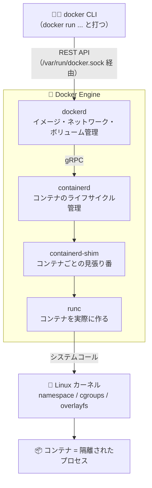

このことは、次のコマンドで確かめられます。

```bash
docker version
```

```text
Client:                ← あなたが打った docker コマンド側
 Version:           27.x.x
 ...
Server: Docker Desktop ← 裏で動いている Docker Engine 側
 Engine:
  Version:          27.x.x
 containerd:
  Version:          1.7.x
 runc:
  Version:          1.1.x
 ...
```

**Client（お客さん）と Server（お店）が別々に表示されている** のがわかりますね。Docker Desktop が起動していないと、Server の部分でエラーになります（13-1 のエラーの正体はこれです）。

> 💡 **runc が仕事を終えると身を引く**
> runc はコンテナを作るとすぐに終了し、あとは containerd-shim がコンテナを見張ります。だから、dockerd を再起動しても（設定次第で）コンテナは動き続けられます。

### A-2. コンテナの正体は「隔離されたただのプロセス」

ここが一番大事な話です。

> **コンテナは「小さな仮想マシン」ではありません。ホストの Linux カーネル上で動く、ただのプロセス（実行中のプログラム）です。**
> ただし、**「見えるもの」と「使える量」を制限されている** プロセスです。

- **見えるものを制限する仕組み** → **namespace（ネームスペース）**
- **使える量を制限する仕組み** → **cgroups（シーグループ）**
- **独自のファイルシステムに見せる仕組み** → **overlayfs（オーバーレイ FS）** などの重ね合わせファイルシステム


**実験してみましょう**（軽量な Linux である Alpine を使います）。

```bash
docker run -d --name sleeper alpine sleep 1000
docker exec sleeper ps
```

```text
PID   USER     TIME  COMMAND
    1 root      0:00 sleep 1000
    7 root      0:00 ps
```

コンテナの中から見ると、`sleep` が **PID 1**（いちばん最初のプロセス）で、他のプロセスは見えません。まるで専用のパソコンのようです。

ところが、ホスト側から見ると……

```bash
docker top sleeper
```

```text
UID    PID     PPID    ...   CMD
root   12345   12320   ...   sleep 1000
```

ホストから見ると **PID は 12345 のような普通の番号** で、ただのプロセスの 1 つにすぎません。（Linux マシンなら `ps aux | grep sleep` でも見えます。Mac / Windows では A-8 で説明する裏の VM の中にいるので、ホストの `ps` には出てきません）

```bash
docker rm -f sleeper   # 後片付け
```

**仮想マシンのように OS を起動しているわけではなく、プロセスを 1 つ立ち上げているだけ。** だから一瞬で起動するのです。

### A-3. namespace：見えるものを制限する

namespace は「**このプロセスには、この範囲しか見せない**」という Linux カーネルの機能です。目隠し付きの部屋に入れるようなイメージです。

| namespace | 隔離するもの | コンテナで起きること |
|---|---|---|
| **pid** | プロセス番号 | 自分が PID 1 に見え、他のコンテナやホストのプロセスが見えない |
| **net** | ネットワーク | 自分専用の IP アドレス・ポート番号を持てる（だから 80 番がかぶらない） |
| **mnt** | ファイルシステムのマウント | 自分専用の `/` （ルートディレクトリ）を持てる |
| **uts** | ホスト名 | 自分専用のホスト名を持てる |
| **ipc** | プロセス間通信 | 他のコンテナと共有メモリなどを共有しない |
| **user** | ユーザー ID | コンテナ内の root をホストの一般ユーザーに対応づけられる（設定時） |
| **cgroup** | cgroup の見え方 | 自分の cgroup だけが見える |

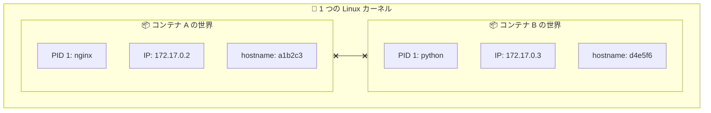

お互いの世界は見えませんが、**土台のカーネルは 1 つ** です。

**実験：ホスト名が違うことを確認**

```bash
docker run --rm alpine hostname
docker run --rm alpine hostname
```

実行するたびに違うホスト名（コンテナ ID の先頭）が表示されます。uts namespace のおかげです。

### A-4. cgroups：使える量を制限する

cgroups（control groups）は「**このプロセスは CPU をここまで、メモリをここまでしか使えない**」と制限する機能です。マンションでいえば「各部屋のブレーカーの容量」です。

```bash
# メモリを 100MB、CPU を 0.5 コア分に制限して起動
docker run -d --name limited --memory 100m --cpus 0.5 nginx

# リアルタイムで使用量を見る（Ctrl + C で終了）
docker stats limited
```

```text
CONTAINER ID   NAME      CPU %     MEM USAGE / LIMIT   MEM %   ...
xxxxxxxxxxxx   limited   0.00%     3MiB / 100MiB       3.00%   ...
```

`LIMIT` が `100MiB` になっています。もしコンテナがこの上限を超えてメモリを使おうとすると、カーネルによって強制終了されます（**OOM Kill**：Out Of Memory Kill）。`docker inspect` で見ると `"OOMKilled": true` になっています。

```bash
docker rm -f limited
```

> 💡 制限を指定しないと、コンテナはホスト（Mac / Windows なら Docker Desktop の VM）のリソースを使えるだけ使えます。

### A-5. イメージの正体：レイヤーの積み重ね

イメージは 1 つの大きなファイルではなく、**「差分（レイヤー）」を積み重ねたもの** です。Dockerfile の **`RUN` / `COPY` / `ADD` などの命令ごとに、1 枚ずつレイヤーができます。**

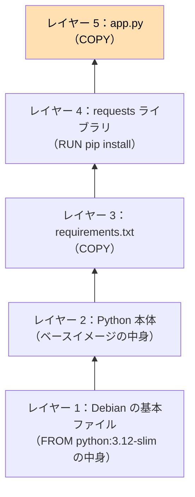

透明なフィルムを何枚も重ねて 1 枚の絵に見せるようなイメージです。10 章で作ったイメージで確認してみましょう。

```bash
docker history my-python-app
```

```text
IMAGE          CREATED BY                                      SIZE
xxxxxxxxxxxx   CMD ["python" "app.py"]                         0B
<missing>      COPY app.py . # buildkit                        xxxB
<missing>      RUN /bin/sh -c pip install --no-cache-dir ...   x.xMB
<missing>      COPY requirements.txt . # buildkit              xxB
<missing>      WORKDIR /app                                    0B
...（ここから下はベースイメージ python:3.12-slim のレイヤー）
```

**レイヤー構造のうれしいこと：**

1. **共有できる**
   `python:3.12-slim` をベースにしたイメージが 10 個あっても、ベース部分のレイヤーは **ディスク上に 1 つだけ** 保存されます。
2. **ダウンロードが速い**
   `docker pull` のときに `Already exists` と表示されるのは、そのレイヤーをすでに持っているからです。
3. **ビルドが速い**
   10-9 章のキャッシュは、まさにこのレイヤー単位で行われています。

> 💡 **レイヤーの名前は中身から作られる**
> 各レイヤーは、中身から計算した **SHA-256 ハッシュ値**（`sha256:abc123...`）で識別されます。中身が 1 ビットでも違えば別の名前になるので、「同じ名前なら絶対に同じ中身」と保証できます。これを **コンテンツアドレス方式** といいます。
> イメージを `nginx@sha256:...` のように **ダイジェスト** で指定すると、タグ（`latest` など）と違って中身が絶対に変わらないことが保証されます。

### A-6. Copy-on-Write：コンテナはどうやって書き込むのか

イメージは読み取り専用なのに、コンテナの中ではファイルを作ったり書き換えたりできました。どうなっているのでしょうか？

答えは、**コンテナを作るときに、イメージの上に「書き込み専用の薄いレイヤー」を 1 枚追加している** からです。

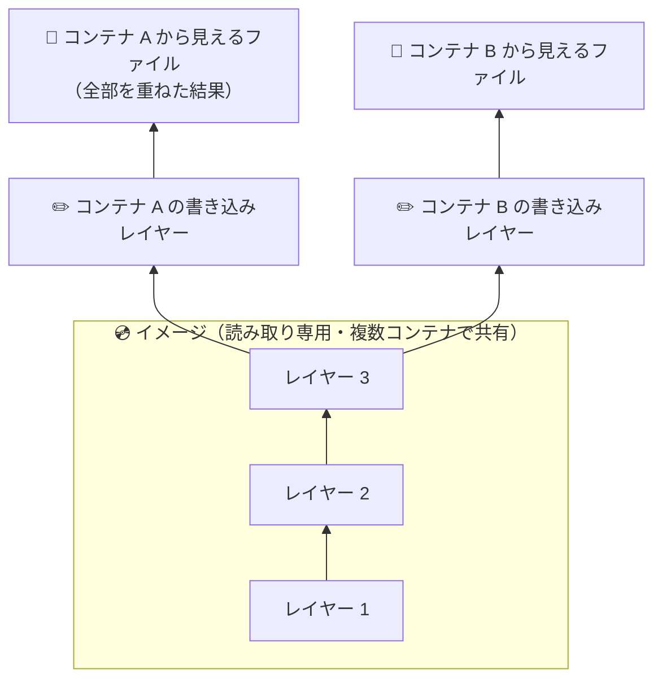

- **ファイルを読むとき**：上のレイヤーから順に探して、最初に見つかったものを使う
- **ファイルを書き換えるとき**：下のレイヤーのファイルを **自分の書き込みレイヤーにコピーしてから** 書き換える（元のイメージは無傷）
- **ファイルを削除するとき**：「これは消えたことにする」という **目印（whiteout）** を書き込みレイヤーに置く

この「書き込むときに初めてコピーする」方式を **Copy-on-Write（CoW）** といいます。Linux では主に **overlayfs** という仕組みで実現されています。

これで次のことが説明できます。

- **コンテナを消すとデータが消える** → 書き込みレイヤーごと捨てるから
- **コンテナを 100 個作ってもディスクをあまり食わない** → イメージ部分は共有で、差分だけ持つから
- **コンテナの起動が速い** → 空っぽの書き込みレイヤーを 1 枚作るだけだから

**実験：コンテナでの変更点を見る**

```bash
docker run --name cow-test alpine sh -c "echo hi > /hello.txt && rm /etc/motd"
docker diff cow-test
```

```text
A /hello.txt     ← A = Added（追加）
D /etc/motd      ← D = Deleted（削除）
```

書き込みレイヤーに記録された差分が見えます。

```bash
docker rm cow-test
```

> ⚠️ **よくある落とし穴**
> ```dockerfile
> RUN curl -o big.zip https://example.com/big.zip   # 500MB のレイヤー
> RUN rm big.zip                                    # 「消した」目印のレイヤー
> ```
> こう書いても、イメージは **小さくなりません**。前のレイヤーに 500MB が残ったまま、上に「消した」目印を重ねているだけだからです。
> 一時ファイルは **同じ `RUN` の中で** ダウンロードして削除するか、B-2 のマルチステージビルドを使いましょう。

### A-7. ネットワークの裏側

`docker run` すると、各コンテナには net namespace によって **専用のネットワーク（IP アドレス）** が与えられます。では、どうやって外とつながっているのでしょうか。

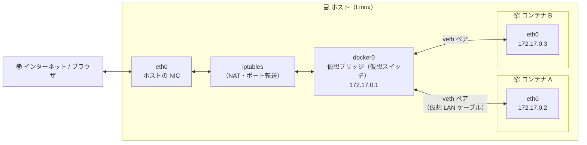

| 部品 | たとえ | 役割 |
|---|---|---|
| **docker0（ブリッジ）** | 家の中の **スイッチングハブ** | コンテナ同士をつなぐ仮想スイッチ |
| **veth ペア** | **LAN ケーブル** | 片方の端がコンテナの中、もう片方がブリッジにささっている仮想ケーブル |
| **iptables（NAT）** | **ルーター** | `-p 8080:80` の設定に従って、ホストに来た通信をコンテナに転送する。コンテナから外へ出る通信のアドレス変換も行う |

#### ネットワークの種類（ドライバ）

```bash
docker network ls
```

```text
NETWORK ID     NAME      DRIVER    SCOPE
xxxxxxxxxxxx   bridge    bridge    local
xxxxxxxxxxxx   host      host      local
xxxxxxxxxxxx   none      null      local
```

| ドライバ | 意味 |
|---|---|
| **bridge** | デフォルト。上の図の仕組み |
| **host** | ネットワークを隔離せず、ホストのネットワークをそのまま使う（Linux 向け。`-p` が不要になる） |
| **none** | ネットワークなし。完全に孤立させたいとき |

#### サービス名で通信できる仕組み（11-7 の種明かし）

`docker network create` で作ったネットワーク（**ユーザー定義ネットワーク**）や、Compose が自動で作るネットワークには、Docker が **内蔵の DNS サーバー**（コンテナからは `127.0.0.11` に見える）を用意してくれます。これが「`db` という名前を IP アドレスに変換」してくれるので、サービス名で通信できるのです。

```bash
docker network create my-net
docker run -d --name server --network my-net nginx
docker run --rm --network my-net alpine ping -c 2 server   # 名前で届く！
docker rm -f server && docker network rm my-net
```

> ⚠️ **デフォルトの `bridge` ネットワークでは、名前での通信はできません。** コンテナ同士を通信させたいときは、必ず自分でネットワークを作るか、Compose を使いましょう。

### A-8. Mac / Windows では何が起きているのか

ここまでの説明で「Linux カーネルの機能」という言葉が何度も出てきました。では、**Linux ではない Mac や Windows でなぜ Docker が動くのでしょうか？**

答え：**Docker Desktop が、裏で小さな Linux の仮想マシンを動かしているから** です。

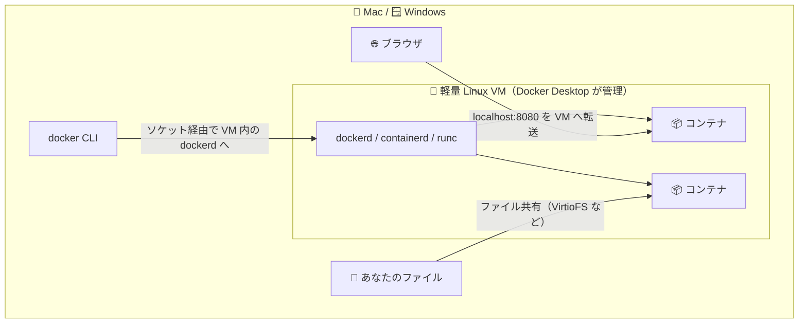

- **Mac**：Apple の仮想化フレームワーク（Virtualization.framework）を使って Linux VM を動かしています。
- **Windows**：**WSL 2**（Windows の中で本物の Linux カーネルを動かす仕組み）を使います。
- **Colima（4-3）**：やっていることは同じです。**Lima** というツールで Linux VM を作り、その中で dockerd を動かしています。`colima ssh` で実際にその VM の中に入れるので、`ps aux` を打つとコンテナのプロセスが「ただのプロセス」として見えます（A-2 の実験の続きができます）。
- **Linux（4-2）**：VM は不要です。ホストのカーネル上で dockerd もコンテナも直接動きます。だから Linux の Docker はいちばん速くて素直です。

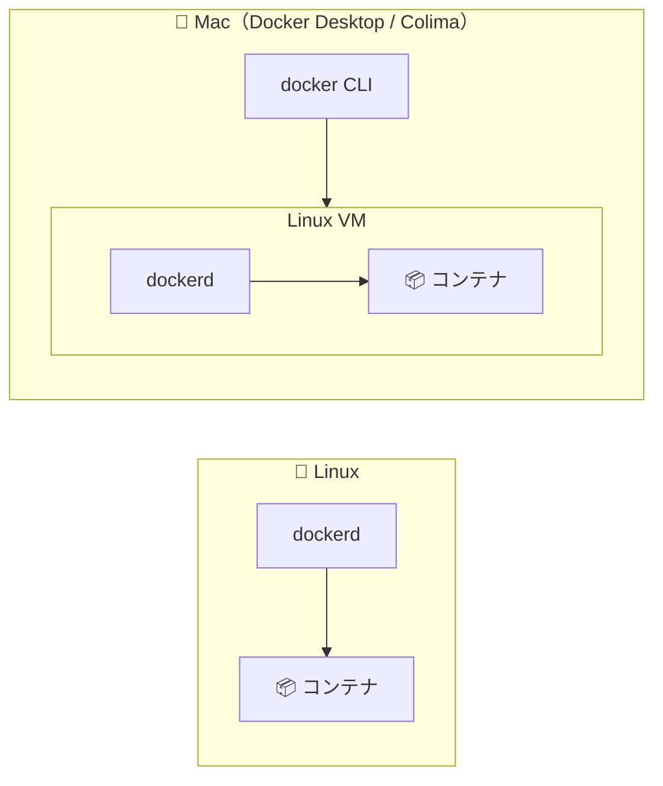

**これで説明できること：**

| 現象 | 理由 |
|---|---|
| Docker Desktop を起動しないと使えない | VM が起動していないと dockerd が存在しないから |
| Docker Desktop の設定でメモリ・CPU の上限を決める | それが VM に割り当てる量だから |
| Mac でバインドマウントが Linux より遅いことがある | Mac のファイルを VM の中に共有する処理が挟まるから |
| Mac の `ps` にコンテナのプロセスが出ない | プロセスは VM の中にいるから |

#### CPU アーキテクチャの話（Apple Silicon ユーザー向け）

コンテナはカーネルを共有するだけで、**CPU の命令は直接実行** します。そのため、イメージは CPU の種類（**アーキテクチャ**）ごとに作られています。

| アーキテクチャ | 主な CPU |
|---|---|
| `linux/amd64`（x86_64） | Intel / AMD |
| `linux/arm64` | Apple Silicon（M1〜）、Raspberry Pi など |

公式イメージの多くは **マルチアーキテクチャ** になっていて、`docker pull` すると自動的に自分の CPU に合ったものが選ばれます。13-8 の警告は、自分の CPU に合わないイメージしかなかったときに出るもので、そのときは **エミュレーション**（別の CPU の命令を翻訳して実行）で動くため遅くなります。

### A-9. OCI：コンテナの世界標準

Docker は今やコンテナの代名詞ですが、コンテナの仕様は **OCI（Open Container Initiative）** という団体が標準化しています。

| 仕様 | 決めていること |
|---|---|
| **Image Spec** | イメージの形式（レイヤー・設定・マニフェストの構造） |
| **Runtime Spec** | コンテナの起動方法（runc はこの仕様の実装） |
| **Distribution Spec** | レジストリとのやり取りの方法（pull / push の API） |

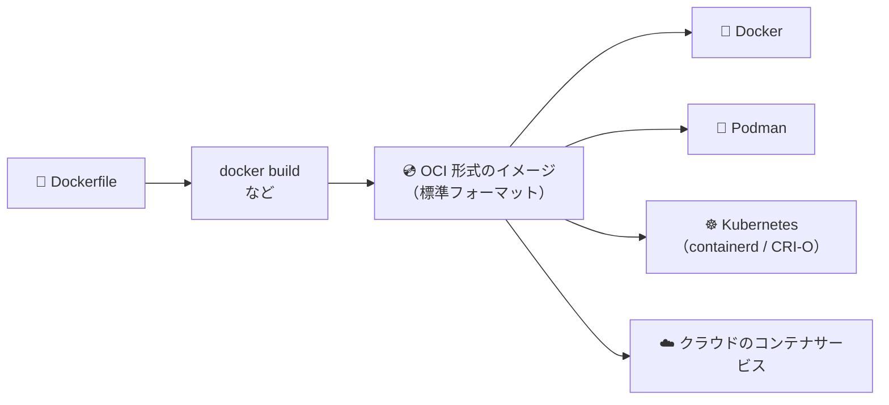

だから、**Docker で作ったイメージは、Docker 以外のツールやクラウドでもそのまま動きます。** Docker を学ぶことは、コンテナ技術全般を学ぶことにつながっているのです。

## B. 一歩進んだ実践テクニック

### B-1. `docker inspect` で中身をのぞく

コンテナやイメージの **詳細情報をすべて JSON 形式で表示** します。困ったときの調査に便利です。

```bash
docker run -d --name web -p 8080:80 nginx
docker inspect web
```

ものすごく長い出力が出ます。`--format` で必要な部分だけ取り出せます。

```bash
# コンテナの IP アドレス
docker inspect --format '{{range .NetworkSettings.Networks}}{{.IPAddress}}{{end}}' web

# コンテナの状態
docker inspect --format '{{.State.Status}}' web

# 設定されている環境変数
docker inspect --format '{{json .Config.Env}}' web
```

```bash
docker rm -f web
```

### B-2. マルチステージビルドでイメージを小さくする

プログラムを **作る（ビルドする）ための道具** と、**動かすために必要なもの** は違います。たとえば Go 言語では、コンパイラ（数百 MB）はビルドにしか必要なく、できあがった実行ファイルだけあれば動きます。

**マルチステージビルド** を使うと、「ビルド用の部屋」で作業して、**完成品だけを「本番用の部屋」に持ち出す** ことができます。

```mermaid
flowchart LR
    subgraph S1["🏗️ ステージ 1：builder<br/>golang イメージ（数百 MB）"]
        SRC["main.go"] --> COMP["go build"] --> BIN["実行ファイル app"]
    end
    subgraph S2["🚀 ステージ 2：本番<br/>軽量イメージ（数 MB）"]
        BIN2["実行ファイル app"]
    end
    BIN -- "COPY --from=builder" --> BIN2
    S1 -. "ステージ 1 は最終イメージに含まれない 🗑️" .-> X["捨てる"]
```

`main.go`：

```go
package main

import "fmt"

func main() {
	fmt.Println("Hello from a tiny image!")
}
```

`Dockerfile`：

```dockerfile
# ===== ステージ 1：ビルド用 =====
FROM golang:1.23 AS builder
WORKDIR /src
COPY main.go .
# 他のライブラリに依存しない実行ファイルを作る
RUN CGO_ENABLED=0 go build -o /app main.go

# ===== ステージ 2：本番用 =====
FROM alpine:3.20
COPY --from=builder /app /app
CMD ["/app"]
```

```bash
docker build -t tiny-app .
docker run --rm tiny-app
docker images tiny-app
```

`golang` イメージは数百 MB ありますが、`tiny-app` は **十数 MB 程度** に収まります。

| ポイント | 説明 |
|---|---|
| `FROM ... AS builder` | ステージに `builder` という名前を付ける |
| `COPY --from=builder` | 別のステージからファイルをコピーする |
| 最後の `FROM` | **最後のステージだけ** が最終イメージになる |

Python や Node.js でも、「ビルド用ツール入りのイメージでライブラリをビルド → 軽量イメージに結果だけコピー」という使い方ができます。

### B-3. root で動かさない（セキュリティ）

何も指定しないと、コンテナの中のプログラムは **root（管理者）** で動きます。もしアプリに脆弱性があって乗っ取られた場合、被害が大きくなる可能性があります。**本番用のイメージでは、一般ユーザーで動かす** のが基本です。

```dockerfile
FROM python:3.12-slim

# 一般ユーザー appuser を作る
RUN useradd --create-home appuser

WORKDIR /app
COPY --chown=appuser:appuser requirements.txt .
RUN pip install --no-cache-dir -r requirements.txt
COPY --chown=appuser:appuser app.py .

# ここから先は appuser として実行
USER appuser

CMD ["python", "app.py"]
```

| 命令 | 意味 |
|---|---|
| `RUN useradd ...` | ユーザーを作る |
| `COPY --chown=ユーザー:グループ` | コピーしたファイルの持ち主を指定する |
| `USER appuser` | 以降の命令とコンテナ実行時のユーザーを切り替える |

> 💡 `docker run --rm my-python-app whoami` で、誰として動いているか確認できます。

### B-4. CMD と ENTRYPOINT、exec 形式と shell 形式

#### CMD と ENTRYPOINT の違い

| 命令 | 役割 | `docker run イメージ 引数` の引数を渡すと？ |
|---|---|---|
| `CMD` | **デフォルトの** コマンド | **丸ごと置き換わる** |
| `ENTRYPOINT` | **必ず実行する** コマンド | **後ろに追加される** |

組み合わせると、「コマンドは固定、引数のデフォルト値だけ CMD で決める」という使い方ができます。

```dockerfile
FROM alpine:3.20
ENTRYPOINT ["ping", "-c", "3"]
CMD ["localhost"]
```

```bash
docker build -t pinger .
docker run --rm pinger              # → ping -c 3 localhost
docker run --rm pinger example.com  # → ping -c 3 example.com（CMD だけ置き換わる）
```

```mermaid
flowchart LR
    E["ENTRYPOINT<br/>ping -c 3"] --- C["CMD<br/>localhost"]
    U["docker run pinger example.com"] -. "CMD部分を上書き" .-> C
```

#### exec 形式と shell 形式

```dockerfile
CMD ["python", "app.py"]   # ✅ exec 形式（JSON 配列）：python が直接 PID 1 になる
CMD python app.py          # ⚠️ shell 形式：/bin/sh -c "python app.py" として実行される
```

**基本は exec 形式（`[...]` で書く方）を使いましょう。** 理由は次の B-5 で説明します。

### B-5. PID 1 問題と、止まらないコンテナ

#### `docker stop` の裏側

`docker stop` は、いきなりコンテナを殺すわけではありません。

```mermaid
sequenceDiagram
    participant D as Docker
    participant P as コンテナの PID 1
    D->>P: SIGTERM（そろそろ終わってね）
    Note over P: 片付けをして終了…するはず
    alt 10 秒以内に終了した
        P-->>D: 終了 ✅
    else 10 秒たっても終了しない
        D->>P: SIGKILL（強制終了！）
        Note over P: 問答無用で終了 💥
    end
```

**シグナル** とは、OS がプロセスに送る「合図」のことです。

#### 何が問題になるのか

shell 形式で書くと、PID 1 は `/bin/sh` になり、本当のアプリはその子プロセスになります。`sh` は受け取った SIGTERM をアプリに **伝えてくれない** ことがあるため：

- `docker stop` に **毎回 10 秒かかる**
- アプリが片付け（データ保存・接続の切断など）をできずに **強制終了される**

という問題が起きます。

**対策：**
1. **CMD / ENTRYPOINT は exec 形式で書く**（いちばん大事）
2. `docker run --init` を付ける（小さな init プロセスが PID 1 になって、シグナルの中継や、終了した子プロセスの後始末をしてくれる）。Compose では `init: true`

#### コンテナがすぐ終わる / ずっと動き続ける理由

> **コンテナは「PID 1 のプロセスが動いている間だけ」動き続けます。**

- `hello-world` → メッセージを出して PID 1 が終了 → コンテナも終了
- `nginx` → nginx が待ち受けを続ける → コンテナも動き続ける

開発中に「とりあえず起動しっぱなしにして、`exec` で入りたい」ときは、ずっと終わらないコマンドを PID 1 にするテクニックがあります。

```bash
docker run -d --name devbox ubuntu sleep infinity
docker exec -it devbox bash
```

### B-6. Compose の起動順とヘルスチェック

`depends_on` を使うと起動の順番を指定できますが、ただ書くだけだと「**コンテナが起動した**」時点で次に進みます。データベースは起動してから **接続を受け付けられるようになるまで数秒かかる** ので、Web アプリが先に接続しに行って失敗することがあります。

そこで **ヘルスチェック（健康診断）** を組み合わせます。

```yaml
services:
  web:
    build: .
    ports:
      - "8000:8000"
    depends_on:
      db:
        condition: service_healthy   # db が「健康」になるまで待つ

  db:
    image: postgres:17
    environment:
      POSTGRES_USER: myuser
      POSTGRES_PASSWORD: mypassword
      POSTGRES_DB: mydb
    healthcheck:
      test: ["CMD-SHELL", "pg_isready -U myuser -d mydb"]
      interval: 5s     # 5 秒ごとにチェック
      timeout: 3s      # 3 秒で応答がなければ失敗
      retries: 10      # 10 回失敗したら unhealthy
```

```mermaid
sequenceDiagram
    participant C as Compose
    participant DB as db
    participant W as web
    C->>DB: 起動
    loop 5 秒ごと
        C->>DB: pg_isready（準備できた？）
        DB-->>C: まだ… / OK！
    end
    Note over DB: healthy ✅
    C->>W: 起動（ここで初めて）
    W->>DB: 接続 → 成功 🎉
```

`docker compose ps` の `STATUS` 欄に `(healthy)` と表示されます。

### B-7. `.env` ファイルで設定を分ける

パスワードなどを `compose.yaml` に直接書くと、Git にうっかり公開してしまう危険があります。**`.env` ファイル** に分けましょう。

`.env`：

```text
POSTGRES_USER=myuser
POSTGRES_PASSWORD=super-secret
POSTGRES_DB=mydb
```

`compose.yaml`：

```yaml
services:
  db:
    image: postgres:17
    environment:
      POSTGRES_USER: ${POSTGRES_USER}
      POSTGRES_PASSWORD: ${POSTGRES_PASSWORD}
      POSTGRES_DB: ${POSTGRES_DB}
```

Compose は **同じフォルダの `.env` を自動で読み込んで**、`${...}` の部分を置き換えてくれます。

> ⚠️ `.env` は **`.gitignore` と `.dockerignore` に必ず追加** しましょう。代わりに、中身をダミーにした `.env.example` を共有すると親切です。

> ⚠️ **イメージにパスワードを焼き込まない**
> Dockerfile の `ENV` や `COPY` で秘密情報を入れると、A-5 で説明したとおり **レイヤーに残り続け**、`docker history` などで見えてしまいます。秘密情報は実行時に環境変数で渡すか、ビルド時に必要な場合は BuildKit の `RUN --mount=type=secret` を使いましょう。

### B-8. 再起動ポリシーとリソース制限

#### 再起動ポリシー

コンテナが落ちたときや、パソコン（Docker）を再起動したときに、自動で起動し直すかどうかを決められます。

| ポリシー | 動作 |
|---|---|
| `no` | 再起動しない（デフォルト） |
| `on-failure` | エラーで終了したとき（終了コードが 0 以外）だけ再起動 |
| `always` | 常に再起動（手動で stop しても、Docker 再起動時には起動する） |
| `unless-stopped` | 常に再起動。ただし **手動で stop したものは起動しない** |

```bash
docker run -d --restart unless-stopped --name web nginx
```

```yaml
# compose.yaml
services:
  web:
    image: nginx
    restart: unless-stopped
```

#### リソース制限（A-4 の cgroups を使う）

```yaml
services:
  web:
    image: nginx
    deploy:
      resources:
        limits:
          cpus: "0.5"     # CPU 0.5 コア分まで
          memory: 256M    # メモリ 256MB まで
```

1 つのコンテナが暴走して、パソコン全体が重くなるのを防げます。

### B-9. イメージを軽く・安全にするコツ

| コツ | 例・理由 |
|---|---|
| **小さいベースイメージを選ぶ** | `python:3.12`（約 1GB）より `python:3.12-slim`（約 100〜150MB）。さらに小さい `alpine` 系もあるが、C ライブラリが違う（musl）ため、Python のライブラリによってはビルドが大変になることも |
| **バージョンを固定する** | `latest` ではなく `python:3.12-slim` のように。再現性のため |
| **RUN をまとめて後片付けする** | 下の例を参照。A-6 の落とし穴対策 |
| **不要なものを入れない** | `apt-get install --no-install-recommends`、`pip install --no-cache-dir` |
| **`.dockerignore` を書く** | `.git` や `node_modules` を送らないとビルドも速くなる |
| **マルチステージビルド** | B-2 参照 |
| **root で動かさない** | B-3 参照 |
| **脆弱性スキャンをする** | `docker scout quickview` や Trivy などのツールで、既知の脆弱性がないか確認できる |

**apt を使うときの定番の書き方：**

```dockerfile
RUN apt-get update \
    && apt-get install -y --no-install-recommends curl \
    && rm -rf /var/lib/apt/lists/*
```

- `&&` でつなげて **1 つの `RUN`（＝1 つのレイヤー）** にまとめる
- 最後に `apt` のキャッシュを削除して、**同じレイヤーの中で** ゴミを残さない
- `\` は「次の行に続く」という意味の改行


## おわりに

最初は「イメージ」「コンテナ」「ボリューム」など、聞き慣れない言葉ばかりで大変だったと思います。でも、Docker の本質はとてもシンプルです。

> **「環境ごと箱に詰めて、どこでも同じように動かす」**

これさえ覚えておけば、細かいコマンドは早見表を見ながら少しずつ覚えていけば大丈夫です。

コンテナは何度壊しても、何度でも作り直せます。**失敗を恐れず、どんどん試してみてください！** 🐳
